# UI001 - ログイン画面

---

## 画面イメージ

---

## 画面詳細

**基本情報**

| 画面ID | 論理画面名   | 物理画面名 | BaseURL |
| ------ | ------------ | ---------- | ------- |
| UI001  | ログイン画面 | login.js   | /       |

**画面情報**

| No  | 画面項目名             | フィールドタイプ | 入力規制       | 必須 | 文字数 | 初期値 | イベント | 備考 |
| --- | ---------------------- | ---------------- | -------------- | ---- | ------ | ------ | -------- | ---- |
| ①   | 画面タイトル           | ラベル           | -              | -    | -      | -      | -        |      |
| ②   | エラーテキスト         | ラベル           | -              | -    | -      | -      | -        |      |
| ③   | ユーザID               | ラベル           | -              | -    | -      | -      | -        |      |
| ④   | ユーザID入力フォーム   | テキストボックス | 半角英数字のみ | ○    | 12     | -      | -        |      |
| ⑤   | パスワード             | ラベル           | -              | -    | -      | -      | -        |      |
| ⑥   | パスワード入力フォーム | テキストボックス | 半角英数字のみ | ○    | 100     | -      | -        |      |
| ⑦   | ログインボタン         | ボタン           | -              | -    | -      | -      | EVT-001  |      |
| ⑧   | 新規登録リンク         | リンク           | -              | -    | -      | -      | EVT-002  |      |
| ⑨   | パスワード再設定リンク | リンク           | -              | -    | -      | -      | EVT-003  |

---

## 処理詳細

- **EVT-000 初期表示**
    1. 画面表示を行う。

 

- **EVT-001 ログインボタン押下**
    1. バリデーションチェックを行う。
        - バリデーションチェックは以下の通り

        | 対象要素               | 必須 | 最小文字数 | 最大文字数 | パターン | その他 |
        | ---------------------- | ---- | ---------- | ---------- | -------- | ------ |
        | ユーザID入力フォーム   | ○    | 12         | 12         | -        | -      |
        | パスワード入力フォーム | ○    | 1          | 100         | -        | -      |

        - バリデーションチェックがエラーの場合、エラーメッセージID `E-001` を `エラーテキスト` に表示し、処理を終了する。
    2. `API001 - ログイン機能` にリクエストを送る。
        - リクエストは以下の通り
            - メソッド：POST
            - リクエストURL：`/user/login`
            - リクエストヘッダー：
                
                | リクエストヘッダー名 | 値               |
                | -------------------- | ---------------- |
                | Content-Type         | application/json |

            - リクエストボディ：
                
                | リクエスト名 | 値                     |
                | ------------ | ---------------------- |
                | ユーザID     | ***④ユーザID入力フォーム***   |
                | パスワード   | ***⑥パスワード入力フォーム*** |

        - レスポンスがエラーの場合、[エラーメッセージID](../../画面エラーメッセージ一覧表.md) `E-001` を ***②エラーテキスト*** に表示し、処理を終了する。
    3. `UI002 - スケジュール画面` に遷移する。

 

- **EVT-002 新規登録リンク押下**
    1. `UI004 - ユーザ登録画面` に遷移する。

 

- **EVT-003 パスワード再設定リンク押下**
    1. `UI003 - パスワード再設定画面` に遷移する。

