# UI003 - パスワード再設定画面

---

## 画面イメージ

---

## 画面詳細

**基本情報**

| 画面ID | 論理画面名              |     物理画面名    | BaseURL |
| ------ | ---------------------- | ---------------- | ------- |
| UI003  | パスワード再設定画面     | pass_edit.js      | /       |

**画面情報**

| No  | 画面項目名             | フィールドタイプ | 入力規制   | 必須  | 文字数  | 初期値  | イベント |  備考 |
| --- | --------------------- | --------------- | --------- | ----- | ------ | ------ | -------- | ---- |
| ①   | 画面タイトル           | ラベル           | -         | -     | -      | -      | -        |      |
| ②   | サクセステキスト        | ラベル          | -         | -     | -      | -      | -        |      |
| ③   | エラーテキスト          | ラベル          | -         | -     | -      | -      | -        |      |
| ④   | ユーザID               | ラベル          | -         | -     | -      | -      | -        |      |
| ⑤   | ユーザID入力フォーム    | テキストボックス | 半角英数字 | ○     | -      | 12     | -        |      |
| ⑥   | 新パスワード            | ラベル          | -         | -     | -      | -      | -        |      |
| ⑦   | 新パスワード入力フォーム | テキストボックス | 半角英数字 | ○     | -      | 1      | -        |      |
| ⑧   | 秘密の質問              | ラベル          | -         | -     | -      | -      | -        |      |
| ⑨   | 秘密の質問入力フォーム   | セレクトボックス | -         | ○     | -      | 7      | -        |      |
| ⑩   | 秘密の答え              | ラベル          | -         | -     | -      | -      | -        |      |
| ⑪   | 秘密の答え入力フォーム   | テキストボックス | 全角/半角  | ○     | -      | 1      | -        |      |
| ⑫   | 送信ボタン              | ボタン          | -         | -     | -      | -      | EVT-001  |      |

---

## 処理詳細

- **EVT-000 初期表示**
    1. 画面表示を行う。

 

- **EVT-001 送信ボタン押下**
    1. バリデーションチェックを行う。
        - バリデーションチェックは以下の通り

        | 対象要素               | 必須  |  最小文字数 | 最大文字数  | パターン | その他 |
        | --------------------- | ----- | ---------- | ---------- | -------- | ------ |
        | ユーザID入力フォーム    | ○     | 12         | 12         | -        | -      |
        | 新パスワード入力フォーム | ○    | 1          | 100        | -        | -      |
        | 秘密の質問入力フォーム | ○   　 | 7          | 7          | -        | -      |
        | 秘密の答え入力フォーム | ○  　  | 1          | 200        | -        | -      |

        - バリデーションチェックがエラーの場合、エラーメッセージID `E-001` を `エラーテキスト` に表示し、処理を終了する。
    2. `API001 - ログイン機能` にリクエストを送る。
        - リクエストは以下の通り
            - メソッド：POST
            - リクエストURL：`/user/login`
            - リクエストヘッダー：
                
                | リクエストヘッダー名 | 値               |
                | -------------------- | ---------------- |
                | Content-Type         | application/json |

            - リクエストボディ：
                
                | リクエスト名 | 値                     |
                | ------------ | ---------------------- |
                | ユーザID     | ***④ユーザID入力フォーム***   |
                | パスワード   | ***⑥パスワード入力フォーム*** |

        - レスポンスがエラーの場合、[エラーメッセージID](../../画面エラーメッセージ一覧表.md) `E-001` を ***②エラーテキスト*** に表示し、処理を終了する。
    3. `UI002 - スケジュール画面` に遷移する。

