# UI005 - ルーティン一覧画面

---

## 画面イメージ

---

## 画面詳細

**基本情報**

| 画面ID | 論理画面名            | 物理画面名            | BaseURL |
| ------ | -------------------- | -------------------- | ------- |
| UI005  | ルーティン一覧画面     | routine_list.js      | /       |

**画面情報**

| No  | 画面項目名                | フィールドタイプ  | 入力規制 | 必須 | 文字数 | 初期値 | イベント | 備考 |
| --- | ------------------------ | ---------------- | ------- | ---- | ------ | ------ | -------- | ---- |
| ①   | 画面タイトル               | ラベル          |  -       | -    | -      | -      | -        |      |
| ②   | ルーティン名               | ラベル          |  -       | -    | -      | -      | -        |      |
| ③   | ルーティン名入力フォーム    | テキストボックス | 半角/全角 | -    | 200    | 1      | -        |      |
| ④   | 検索ボタン                | ボタン           |  -       | -    | -      | -      | EVT-001  |      |
| ⑤   | ルーティン名              | ラベル           | -        | -    | -      | -      | -       |      |
| ⑥   | 日数                     | ラベル           |  -       | -    | -      | -      | -        |      |
| ⑦   | ルーティン一覧テーブル     | テーブル         |  -       | -    | -      | -      | -        |      |
| ⑧   | 詳細ボタン                | ボタン           |  -       | -    | -      | -      | EVT-002  |      |
| ⑨   | 編集ボタン                | ボタン           |  -       | -    | -      | -      | EVT-003  |      |
| ⑩   | 削除ボタン                | ボタン           |  -       | -    | -      | -      | EVT-004  |      |

---

## 処理詳細

- **EVT-000 初期表示**
    1. 画面表示を行う。

 

