# UI008 - ルーティン編集／削除画面

---

## 画面イメージ

---

## 画面詳細

**基本情報**

| 画面ID | 論理画面名                  | 物理画面名             | BaseURL |
| ------ | -------------------------- | --------------------- | ------- |
| UI008  | ルーティン編集／削除画面     | routine_edit.js      | /       |

**画面情報**

| No  | 画面項目名              | フィールドタイプ | 入力規制     | 必須 | 文字数 | 初期値 | イベント | 備考 |
| --- | ---------------------- | -------------- | ----------- | ---- | ------ | ------ | -------- | ---- |
| ①   | 画面タイトル            | ラベル         | -           | -    | -      | -      | -        |      |
| ②   | エラーテキスト          | ラベル         | -           | -    | -      | -      | -        |      |
| ③   | ルーティン名            | ラベル         | -           | -    | -      | -      | -        |      |
| ④   | 更新ボタン              | ボタン         | -           | -    | -      | -      | EVT-001  |      |
| ⑤   | ルーティン名入力フォーム | テキストボックス | 半角 / 全角 | ○    | 200    | 1      | -        |      |
| ⑥   | 日数                   | ラベル          | -           | -    | -      | -      | -        |      |
| ⑦   | 献立                   | ラベル          | -           | -    | -      | -      | -        |      |
| ⑧   | ルーティンテーブル      | テーブル         | -          | -    | -      | -      | -        |      |
| ⑨   | 時間帯                 | ラベル           | -          | -    | -      | -      | -        |      |
| ⑩   | 食材一覧               | ラベル           | -          | -    | -      | -      | -        |      |
| ⑪   | 検索ボタン             | ボタン           | -          | -    | -      | -      | EVT-002  |      |
| ⑫   | 検索フォーム           | テキストボックス  | 半角 / 全角 | -    | -      | -      | -        |      |
| ⑬   | 食材名                 | ラベル           | -         | -    | -      | -      | -        |      |

---

## 処理詳細

- **EVT-000 初期表示**
    1. 画面表示を行う。

 

