# UI011 - 料理詳細画面

---

## 画面イメージ

---

## 画面詳細

**基本情報**

| 画面ID | 論理画面名   | 物理画面名      | BaseURL |
| ------ | ----------- | -------------- | ------- |
| UI011  | 料理詳細画面 | cook_detail.js | /       |

**画面情報**

| No  | 画面項目名     | フィールドタイプ | 入力規制     | 必須 | 文字数 | 初期値 | イベント | 備考 |
| --- | ------------- | -------------- | ------------ | ---- | ------ | ------ | -------- | ---- |
| ①   | 料理名         | ラベル         | -            | -    | -      | -      | -        |      |
| ②   | 編集ボタン     | ボタン         | -            | -    | -      | -      | EVT-001  |      |
| ③   | 共有ボタン     | ボタン         | -            | -    | -      | -      | EVT-002  |      |
| ④   | コピーボタン   | ボタン         | -            | -    | -      | -      | EVT-003  |      |
| ⑤   | 削除ボタン     | ボタン         | -            | -    | -      | -      | EVT-004  |      |
| ⑥   | 共有解除ボタン | ボタン         | -            | -    | -      | -      | EVT-005  |      |
| ⑦   | 【食材】      | ラベル          | -            | -    | -      | -      | -        |      |
| ⑧   | 食材          | ラジオボタン    | -            | -    | -      | -      | -        |      |
| ⑨   | 【手順】      | ラベル          | -            | -    | -      | -      | -        |      |
| ⑩   | 手順          | ラベル          | -            | -    | -      | -      | -        |      |
| ⑪   | 【動画】      | ラベル          | -            | -    | -      | -      | -        |      |
| ⑫   | 動画          | 動画            | -            | -    | -      | -      | -        |      |

---

## 処理詳細

- **EVT-000 初期表示**
    1. 画面表示を行う。

 

