# UI000 - （画面名）画面

---

## 画面イメージ

---

## 画面詳細

**基本情報**

| 画面ID | 論理画面名 | 物理画面名 | BaseURL |
| ------ | ---------- | ---------- | ------- |
| UI000  | ～画面     | ～.js      | /       |

**画面情報**

| No  | 画面項目名 | フィールドタイプ     | 入力規制     | 必須 | 文字数 | 初期値 | イベント | 備考 |
| --- | ---------- | -------------------- | ------------ | ---- | ------ | ------ | -------- | ---- |
| ①   | 要素名     | 【フィールドタイプ】 | 【入力規制】 | -    | -      | -      | -        |      |
| ②   | 要素名     | 【フィールドタイプ】 | 【入力規制】 | -    | -      | -      | -        |      |
| ③   | 要素名     | 【フィールドタイプ】 | 【入力規制】 | -    | -      | -      | -        |      |

- 【フィールドタイプ】は以下の通り
    - ラベル：`<label>`
    - テキストボックス：`<input type="text">`
    - パスワード：`<input type="password">`
    - 数値：`<input type="number">`
    - チェックボックス：`<input type="checkbox">`
    - ラジオボタン：`<input type="radio">`
    - レンジ：`<input type="range">`
    - ファイル：`<input type="file">`
    - 隠しデータ：`<input type="hidden">`
    - 画像：`<input type="image">`
    - 動画：`<YouTube videoId="" className={style.iframe} containerClassName={style.youtube} />`
    - ボタン：`<button type="button">` or `<input type="button">` or `<input type="submit">`
    - リンク：`<a href="">`

- 【入力規制】は以下の通り
    - `全角/半角`
    - `半角数字`
    - `半角英数字`
    - `半角英数字記号`

---

## 処理詳細

- **EVT-000 初期表示**
    1. 画面表示を行う。

 

