# UI015 - 食材一覧画面

---

## 画面イメージ

---

## 画面詳細

**基本情報**

| 画面ID | 論理画面名       | 物理画面名         | BaseURL |
| ------ | --------------- | ----------------- | ------- |
| UI015  | 食材一覧画面     | food_list.js      | /       |

**画面情報**

| No  | 画面項目名         | フィールドタイプ | 入力規制  | 必須 | 文字数 | 初期値 | イベント | 備考 |
| --- | ------------------| --------------- | -------- | ---- | ------ | ------ | -------- | ---- |
| ①   | 画面タイトル       | ラベル          |  -        | -    | -      | -      | -        |      |
| ②   | 食材登録ボタン     | ボタン          |  -        | -    | -      | -      | EVT-001  |      |
| ③   | 食材名            | ラベル          |  -        | -    | -      | -      | -        |      |
| ④   | 食材名入力フォーム | テキストボックス | 半角/全角  | -    | -      | -      | -        |      |
| ⑤   | 単位              | ラベル          |  -        | -    | -      | -      | -        |      |
| ⑥   | 単位入力フォーム   | テキストボックス | 半角英数字 | -    | -      | -      | -        |      |
| ⑦   | 検索ボタン         | ボタン          |  -        | -    | -      | -      | EVT-002 |      |
| ⑧   | ルーティン名       | ラベル          | -         | -    | 200    | 1      | -       |      |
| ⑨   | 日数              | ラベル          |  -        | -    | -      | -      | -       |      |
| ⑩   | 食材一覧テーブル   | テーブル        |  -        | -    | -      | -      | -        |      |
| ⑪   | 詳細ボタン         | ボタン          |  -       | -    | -      | -      | EVT-003  |      |
| ⑫   | 編集ボタン         | ボタン          |  -       | -    | -      | -      | EVT-004  |      |
| ⑬   | 削除ボタン         | ボタン          |  -       | -    | -      | -      | EVT-005  |      |

---

## 処理詳細

- **EVT-000 初期表示**
    1. 画面表示を行う。

 

