# UI017 - 食材詳細画面

---

## 画面イメージ

---

## 画面詳細

**基本情報**

| 画面ID | 論理画面名   | 物理画面名      | BaseURL |
| ------ | ----------- | -------------- | ------- |
| UI017  | 食材詳細画面 | food_detail.js | /       |

**画面情報**

| No  | 画面項目名       | フィールドタイプ | 入力規制     | 必須 | 文字数 | 初期値 | イベント | 備考 |
| --- | --------------- | --------------- | ----------- | ---- | ----- | ------ | -------- | ---- |
| ①   | 画面タイトル     | ラベル           | -          | -    | -      | -      | -        |      |
| ②   | 食材名          | ラベル           | -          | -    | -      | -      | -        |      |
| ③   | 食材名          | ラベル           | -          | -    | -      | -      | -        |      |
| ④   | 単位            | ラベル           | -          | -    | -      | -      | -        |      |
| ⑤   | 単位ラジオボタン | ラジオボタン      | -          | -    | -      | -      | -       |      |

---

## 処理詳細

- **EVT-000 初期表示**
    1. 画面表示を行う。

 

