# UI018 - 食材編集画面

---

## 画面イメージ

---

## 画面詳細

**基本情報**

| 画面ID | 論理画面名   | 物理画面名      | BaseURL |
| ------ | ----------- | -------------- | ------- |
| UI018  | 食材編集画面 | food_edit.js  | /       |

**画面情報**

| No  | 画面項目名         | フィールドタイプ | 入力規制   | 必須 | 文字数 | 初期値 | イベント | 備考 |
| --- | ----------------- | --------------- | --------- | ---- | ------ | ------ | -------- | ---- |
| ①   | 画面タイトル       | ラベル          | -          | -    | -      | -      | -        |      |
| ②   | サクセステキスト   | ラベル          | -          | -    | -      | -      | -        |      |
| ③   | エラーテキスト     | ラベル          | -          | -    | -      | -      | -        |      |
| ④   | 食材名            | ラベル          | -          | -    | -      | -      | -        |      |
| ⑤   | 食材名入力フォーム | テキストボックス | 半角 / 全角 | ○    | 200    | 1      | -        |      |
| ⑥   | 単位              | ラベル          | -          | -    | -      | -      | -        |      |
| ⑦   | 単位ラジオボタン   | ラジオボタン     | -          | ○    | -      | -      | -        |      |
| ⑧   | 編集ボタン         | ボタン          | -          | -    | -      | -      | EVT-001  |      |
| ⑨   | 削除ボタン         | ボタン          | -          | -    | -      | -      | EVT-002  |      |

---

## 処理詳細

- **EVT-000 初期表示**
    1. 画面表示を行う。

 

