# UI019 - ユーザ登録画面

---

## 画面イメージ

---

## 画面詳細

**基本情報**

| 画面ID | 論理画面名        | 物理画面名 | BaseURL |
| ------ | ---------------- | ---------- | ------- |
| UI019  | ユーザ編集画面    | user_edit.js      | /       |

**画面情報**

| No  | 画面項目名             | フィールドタイプ | 入力規制   | 必須  | 文字数  | 初期値  | イベント |  備考 |
| --- | --------------------- | --------------- | --------- | ----- | ------ | ------ | -------- | ---- |
| ①   | 画面タイトル           | ラベル           | -         | -     | -      | -      | -        |      |
| ②   | サクセステキスト        | ラベル          | -         | -     | -      | -      | -        |      |
| ③   | エラーテキスト          | ラベル          | -         | -     | -      | -      | -        |      |
| ④   | ユーザID               | ラベル          | -         | -     | -      | -      | -        |      |
| ⑤   | ユーザID入力フォーム    | テキストボックス | 半角英数字 | ○     | 12      | 12     | -        |      |
| ⑥   | パスワード              | ラベル          | -         | -     | -      | -      | -        |      |
| ⑦   | パスワード入力フォーム   | テキストボックス | 半角英数字 | ○     | 100    | 1      | -        |      |
| ⑧   | 秘密の質問              | ラベル          | -         | -     | -      | -      | -        |      |
| ⑨   | 秘密の質問入力フォーム   | セレクトボックス | -         | ○     | 7      | 7      | -        |      |
| ⑩   | 秘密の答え              | ラベル          | -         | -     | -      | -      | -        |      |
| ⑪   | 秘密の答え入力フォーム   | テキストボックス | 全角/半角  | ○     | 200    | 1      | -        |      |
| ⑫   | 編集ボタン              | ボタン          | -         | -     | -      | -      | EVT-001  |      |
| ⑬   | 削除ボタン              | ボタン          | -         | -     | -      | -      | EVT-002  |      |

---

## 処理詳細

- **EVT-000 初期表示**
    1. 画面表示を行う。

 

