# 画面一覧

---

## 画面遷移図

---

## 画面一覧

- [UI001 - ログイン画面](./画面/UI001/UI001.md)
- [UI002 - スケジュール画面](./画面/UI002/UI002.md)
- [UI003 - パスワード再設定画面](./画面/UI003/UI003.md)
- [UI004 - ユーザ登録画面](./画面/UI004/UI004.md)
- [UI005 - ルーティン一覧画面](./画面/UI005/UI005.md)
- [UI006 - ルーティン登録画面](./画面/UI006/UI006.md)
- [UI007 - ルーティン詳細画面](./画面/UI007/UI007.md)
- [UI008 - ルーティン編集/削除画面](./画面/UI008/UI008.md)
- [UI009 - 料理一覧画面](./画面/UI009/UI009.md)
- [UI010 - 料理登録画面](./画面/UI010/UI010.md)
- [UI011 - 料理詳細画面](./画面/UI011/UI011.md)
- [UI012 - 料理編集/削除画面](./画面/UI012/UI012.md)
- [UI013 - 料理複製画面](./画面/UI013/UI013.md)
- [UI014 - 料理共有解除画面](./画面/UI014/UI014.md)
- [UI015 - 食材一覧画面](./画面/UI015/UI015.md)
- [UI016 - 食材登録画面](./画面/UI016/UI016.md)
- [UI017 - 食材詳細画面](./画面/UI017/UI017.md)
- [UI018 - 食材編集/削除画面](./画面/UI018/UI018.md)
- [UI019 - ユーザ編集画面](./画面/UI019/UI019.md)
- [UI020 - 管理者画面](./画面/UI020/UI020.md)

---

## 共通画面一覧

---

## 画面エラーメッセージ一覧表

- [UI画面エラーメッセージ一覧表](./画面エラーメッセージ一覧表.md)
