# 画面設計書作成方法

## 準備

1. Trello(非公開)から作成する画面を選択する。
    - 作成する画面は `作業中` に移動する。
    - 作成する画面ははAPI設計が終わっているものが望ましい。

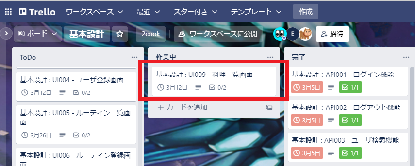

2. 作成する画面を決めたら、[【Gitリポジトリ】/2cook/01基本設計/02画面設計/画面/tmp](./画面/tmp/) をコピーする。

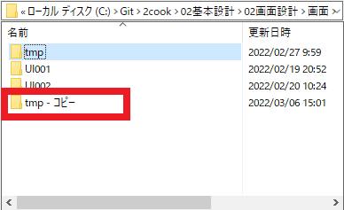

1. 名前を画面IDに変更する。
    - 画面IDは [画面一覧](./画面一覧.md) に記載されている。

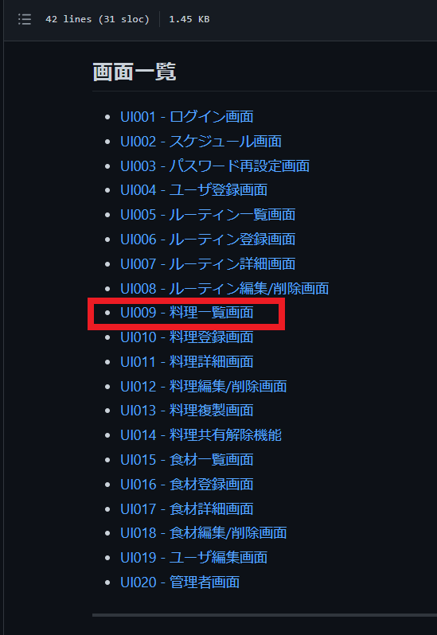
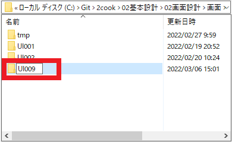

4. フォルダ内のMDファイルを `【画面ID】.md` に変更する。

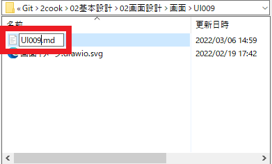

5. [【Gitリポジトリ】/2cook/01要件定義/2Cook画面イメージ.ods](../../01要件定義/) を開き、作成する画面を確認する。
    - `2Cook画面イメージ.ods` の画面名シートを探す。
    - 画面名は [画面一覧](./画面一覧.md) に記載されている。

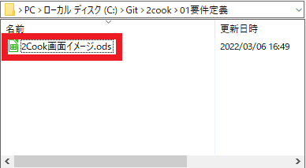
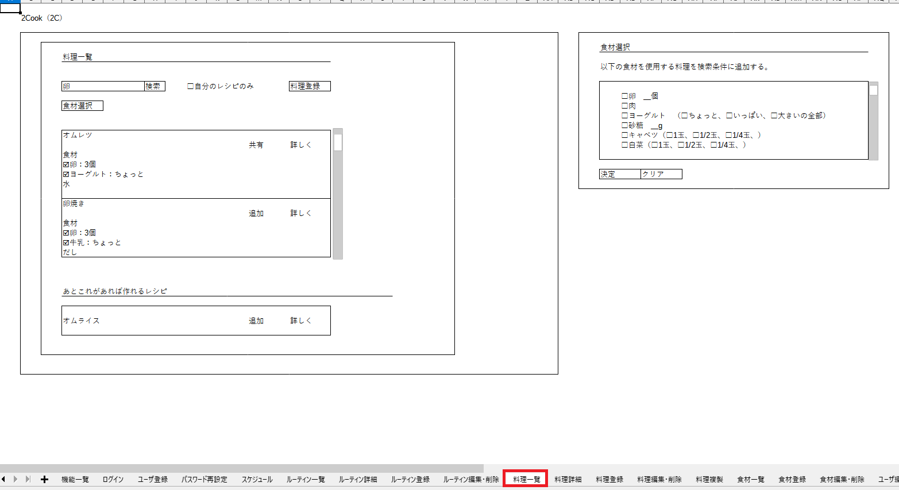

---

## 画面イメージ作成方法

1. [【Gitリポジトリ】/2cook/01基本設計/02画面設計/画面](./画面/) でvscodeを開く。
    - vscodeに拡張機能 `Draw.io Integration` が入っていること。

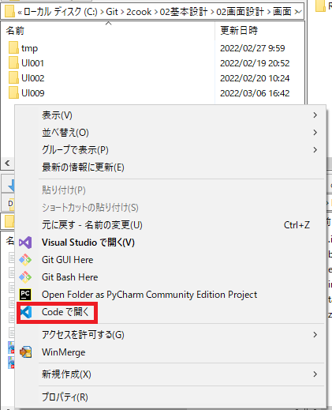
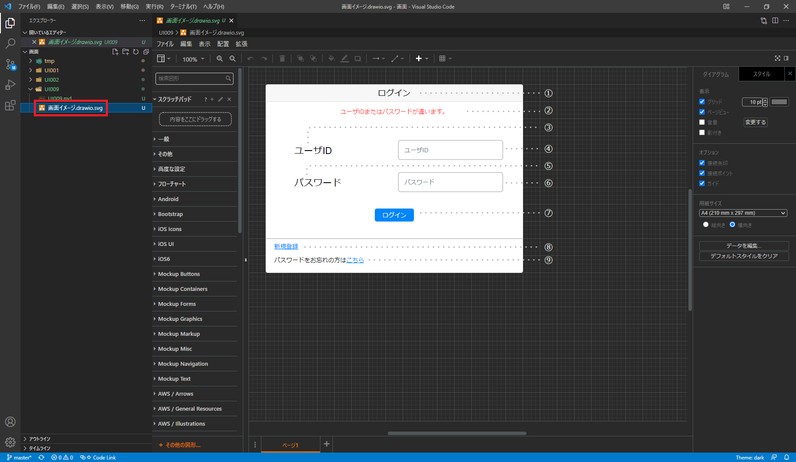

1. `画面イメージ.drawio.svg` を [2Cook画面イメージ.ods](../../01要件定義/) の画面名シートを参考に作成する。
    - [2Cook画面イメージ.ods](../../01要件定義/) で分からないことがある場合は、[MatterのQ&A](../../readme.md#Q&A) で質問すること。

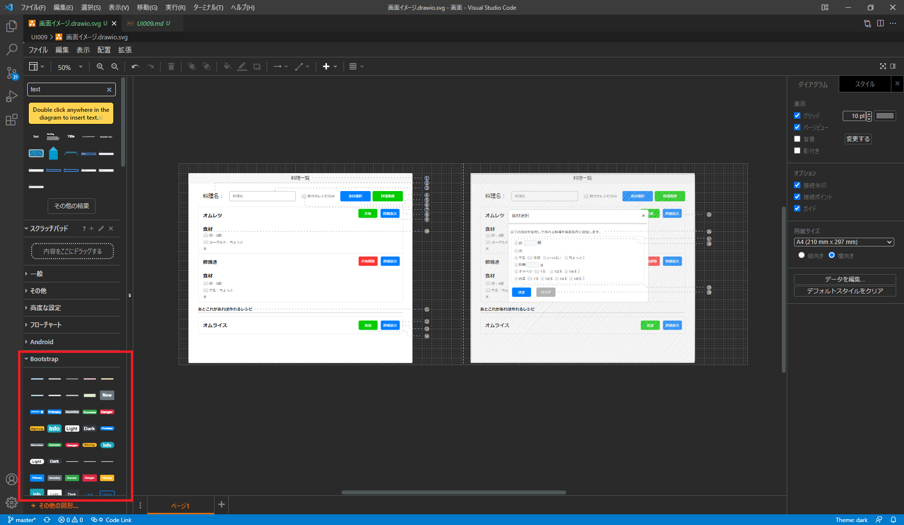

### 画面イメージ作成時の決まり事
- ボタンの色
    - 決定、選択、検索 : `007FFF`
    - 登録、追加 : `00CC00`
    - 解除、削除 : `FF3333`
    - キャンセル、クリア : `B3B3B3`
    ※ ボタン要素を選択し、`塗りつぶし` から色変更が可能

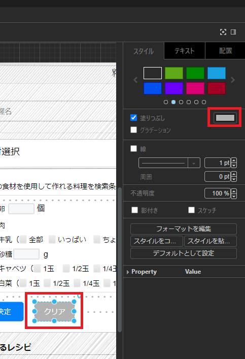
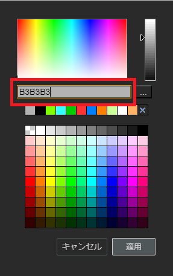

- 画面要素
    - 作成時は左タブの `Bootstrap` の要素のみを使用すること。

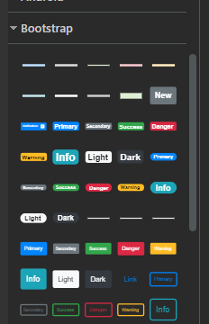

---

## UI～.md作成方法
1. [【Gitリポジトリ】/2cook/01基本設計/02画面設計/画面](./画面/) でvscodeを開く。

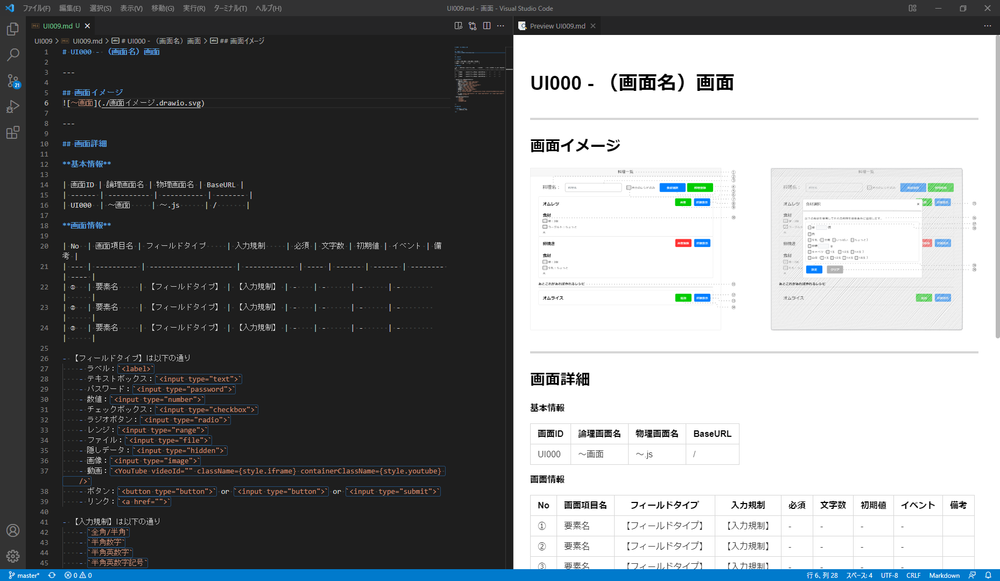

2. タイトルは `UI（画面ID） - （画面名）画面` に変更する。
    - 画面ID、画面名は [画面一覧](./画面一覧.md) に記載されている。

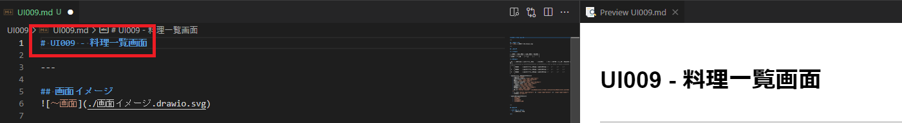

3. 画面詳細を記載する。
    - 基本情報
        - 画面ID、論理画面名は [画面一覧](./画面一覧.md) に記載されている。
        - 物理画面名、BaseURLは `半角英数字` で何画面か分かるように名前を付ける。
    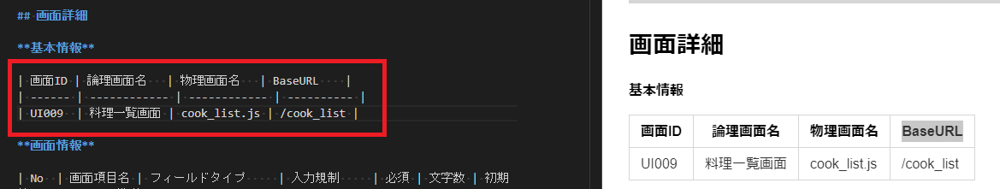

    - 画面情報
        - 「No」は 連番①～㊿を記載する。
        - 「画面項目名」は 各要素の配置された用途に応じて記載する。（例：料理名入力フォーム　など）
        - 「フィールドタイプ」は以下から要素に合ったものを選ぶ。
            - ラベル：`<label>`
            - カード：`
`
            - モーダルウィンドウ：`
`
            - テキストボックス：`<input type="text">`
            - パスワード：`<input type="password">`
            - 数値：`<input type="number">`
            - チェックボックス：`<input type="checkbox">`
            - ラジオボタン：`<input type="radio">`
            - レンジ：`<input type="range">`
            - ファイル：`<input type="file">`
            - 隠しデータ：`<input type="hidden">`
            - 画像：`<input type="image">`
            - 動画：`<YouTube videoId="" className={style.iframe} containerClassName={style.youtube} />`
            - ボタン：`<button type="button">` or `<input type="button">` or `<input type="submit">`
            - リンク：`<a href="">`
        - 「入力規制」は [テーブル定義書.ods](../03DB設計/) から要素に合ったものを選ぶ。
            - `全角/半角`
            - `半角数字`
            - `半角英数字`
            - `半角英数字記号`
        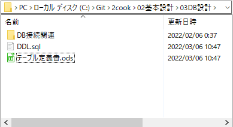
        - 「必須」、「文字数」は [テーブル定義書.ods](../03DB設計/) に記載されている。（「NN」の項目を必須と解釈する。）
            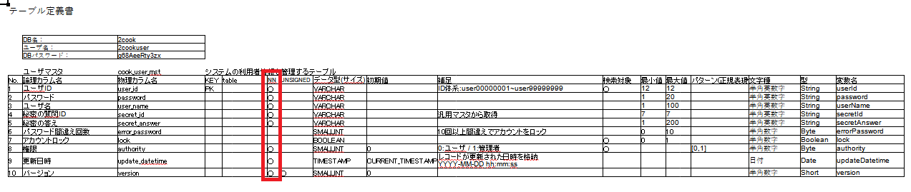
        - 「初期値」は [2Cook画面イメージ.ods](../../01要件定義/) に記載があれば入力する。
        - 「イベント」は ボタンやリンクまたはロジックが関係する要素に `EVT-001 ～ EVT-999` の連番で記載する。
        - 「備考」は 特殊な表示方法やロジックがある場合に記載する。
    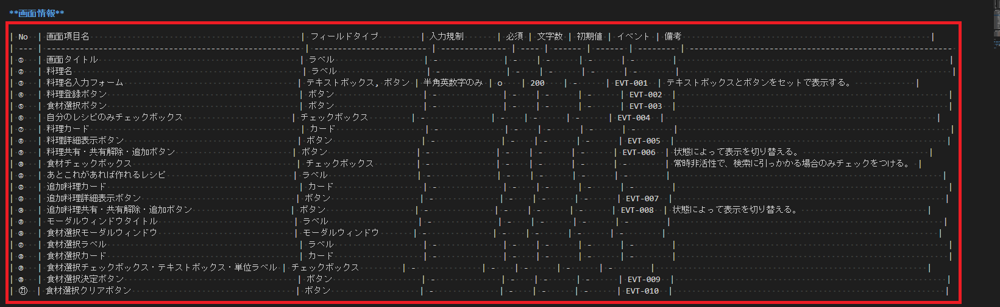

4. 「【フィールドタイプ】は以下の通り」と「【入力規制】は以下の通り」の記載を消す。

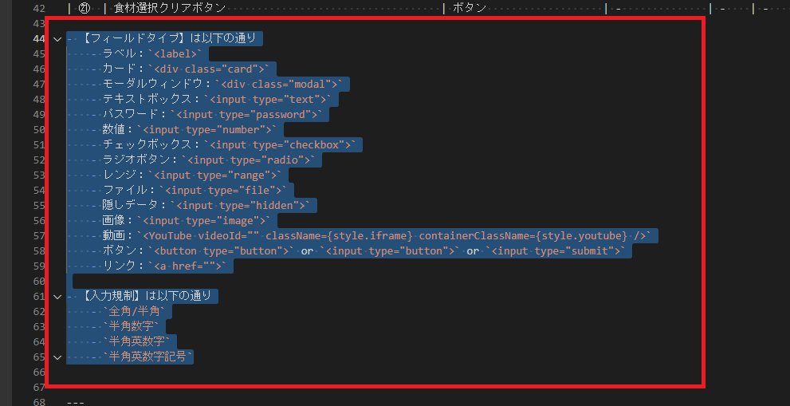

5. 処理詳細を記載する。
    - イベントタイトルは `EVT-連番 イベント名` にする。
        - イベント名に関してはどんな処理か分かるように名前を付ける。

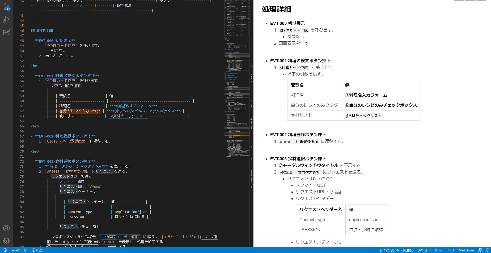

6. フォーマッターを行う（`shift` + `alt` + `F`）。

### 処理詳細作成時の決まり事
- 変数を作成する時は、 `@変数名` とする。（例：`＠料理リスト`）
- 画面詳細の画面情報を使用する時は ***太字*** で `（連番）画面項目名` とする。 （例：***②料理名***）
- メソッド（関数）または共通処理を作成する時は、メソッドタイトルを `FUNC-連番 メソッド名` とし、使用する時は、 `$メソッド名` とする。（例：'$料理カード作成'）
    - 引数については別途記載すること
- APIリクエストに関しては、 [【Gitリポジトリ】/2cook/98開発環境/02各種設定方法/API設計書（Swagger）をwebで表示する方法.md](../../98開発環境/02各種設定方法/API設計書（Swagger）をwebで表示する方法.md) を参考にすること。

