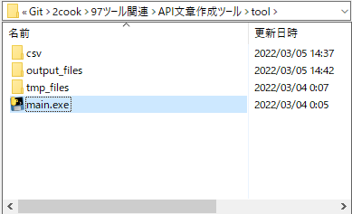

# API文章作成ツール

# 使い方
1. `テーブル定義書.xlsx` の `テーブル定義書` シートの各テーブルをCSVに変換します。
    - ファイル名は `テーブル名.csv`
    - CSV格納場所は [Gitリポジトリ/97ツール関連/API文章作成ツール/tool/csv/](./tool/csv/) 

2. [Gitリポジトリ/97ツール関連/API文章作成ツール/tool/main.exe](./tool/) を起動する

3. [Gitリポジトリ/97ツール関連/API文章作成ツール/tool/output_files/](./tool/output_files/) 配下に `テーブル名` ディレクトリとその配下に以下のテキストファイルが出来ていれば成功
    - api_delete_テーブル名.txt
    - api_get_テーブル名.txt
    - api_oneget_テーブル名.txt
    - api_post_テーブル名.txt
    - api_put_テーブル名.txt

