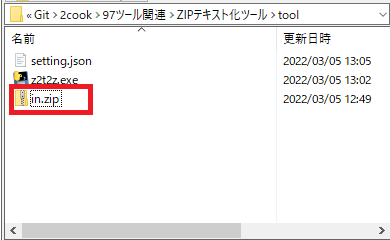
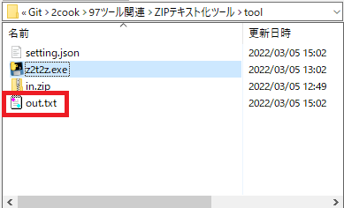
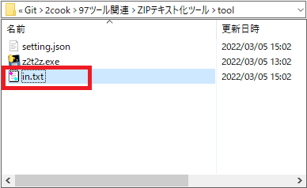
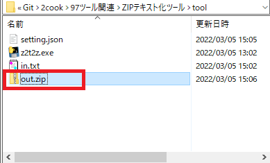

# ZIPテキスト化ツール

# 使い方

## ① ZIPファイルをテキストファイルに変換
1. テキストファイルにしたいZIPファイルの名前を `in.zip` にする。
2. `in.zip` を [Gitリポジトリ/97ツール関連/ZIPテキスト化ツール/tool/](./tool/) に配置する。



3. `setting.json` を以下に変更する。

```
{
  "setting": "e",
  "input": "./",
  "output": "./",
  "コメント": "inputは対象ディレクトリのパス、outputは出力先パス、エンコード z2tは「e」、デコード t2zは「d」、ファイル名は「in.zip」または「in.txt」"
}
```

4. `z2t2z.exe` を起動させる
5. `out.txt` が作成されれば成功



---

## ② テキストファイルをZIPファイルに変換
1. ZIPファイルに戻したいテキストファイルの名前を `in.txt` にする。
2. `in.txt` を [Gitリポジトリ/97ツール関連/ZIPテキスト化ツール/tool/](./tool/) に配置する。



3. `setting.json` を以下に変更する。

```
{
  "setting": "d",
  "input": "./",
  "output": "./",
  "コメント": "inputは対象ディレクトリのパス、outputは出力先パス、エンコード z2tは「e」、デコード t2zは「d」、ファイル名は「in.zip」または「in.txt」"
}
```

4. `z2t2z.exe` を起動させる
5. `out.zip` が作成されれば成功

