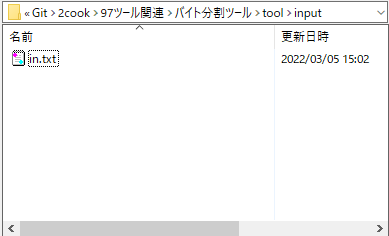
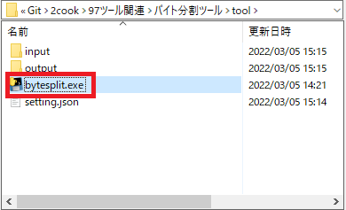
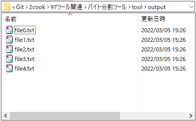
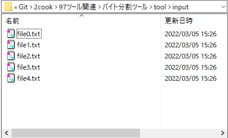
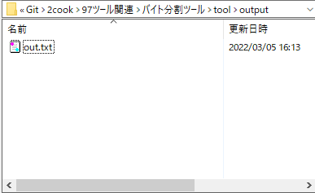

# バイト分割ツール

# 使い方

## ① テキストファイルをバイト単位で分割
1. 分割したいテキストファイルの名前を `in.txt` にする。
2. `in.txt` を [Gitリポジトリ/97ツール関連/ZIPテキスト化ツール/tool/input/](./tool/input/) に配置する。



3. [Gitリポジトリ/97ツール関連/ZIPテキスト化ツール/tool/](./tool/) 配下の `setting.json` を以下に変更する。

```
{
  "setting": "s",
  "encoding": "shift_jis",
  "byte": "51380224",
  "input": "./input/",
  "output": "./output/",
  "コメント": "settingには「分割：s」または「結合:j」、byteには分割したいバイト数を入力、inputは対象ディレクトリのパス、outputは出力先パス、ファイル名は「input.txt」、初期値はencoding：「shift_jis」、byte：「51380224」（49MB）、input：「./input/」、output：「./output/」"
}
```

4. [Gitリポジトリ/97ツール関連/ZIPテキスト化ツール/tool/](./tool/) 配下の `bytesplit.exe` を起動させる
5. [Gitリポジトリ/97ツール関連/ZIPテキスト化ツール/tool/output/](./tool/output/) 配下に `file（連番）.txt` が作成されれば成功




## ② 分割ファイルを統合
1. 統合したいテキストファイルを [Gitリポジトリ/97ツール関連/ZIPテキスト化ツール/tool/input/](./tool/input/) に配置する。



2. [Gitリポジトリ/97ツール関連/ZIPテキスト化ツール/tool/](./tool/) 配下の `setting.json` を以下に変更する。

```
{
  "setting": "j",
  "encoding": "shift_jis",
  "byte": "51380224",
  "input": "./input/",
  "output": "./output/",
  "コメント": "settingには「分割：s」または「結合:j」、byteには分割したいバイト数を入力、inputは対象ディレクトリのパス、outputは出力先パス、ファイル名は「input.txt」、初期値はencoding：「shift_jis」、byte：「51380224」（49MB）、input：「./input/」、output：「./output/」"
}
```

4. [Gitリポジトリ/97ツール関連/ZIPテキスト化ツール/tool/](./tool/) 配下の `bytesplit.exe` を起動させる
5. [Gitリポジトリ/97ツール関連/ZIPテキスト化ツール/tool/output/](./tool/output/) 配下に `out.txt` が作成されれば成功


