# 7zipインストール方法

# Windows10 で 64 bit , 32 bit のどちらかを確認する方法

1. 自分のPCのbit数を把握してる人は飛ばしてください。

2. ツールバーのWindows マークをクリックして設定をクリック

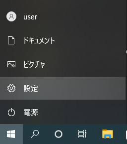

3. システムをクリック

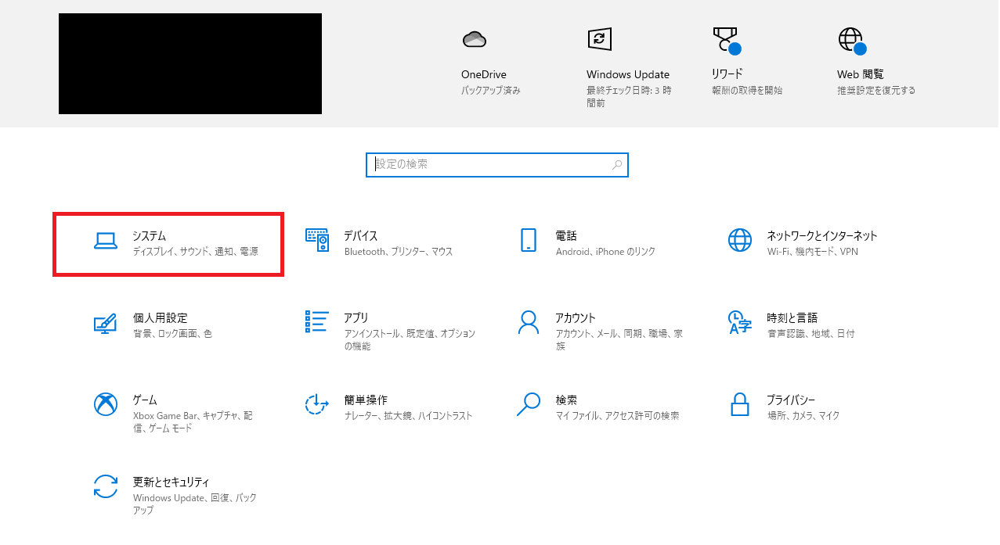

4. 一番下の`詳細情報`をクリックし、`システムの種類`を見てbit数を確認する。

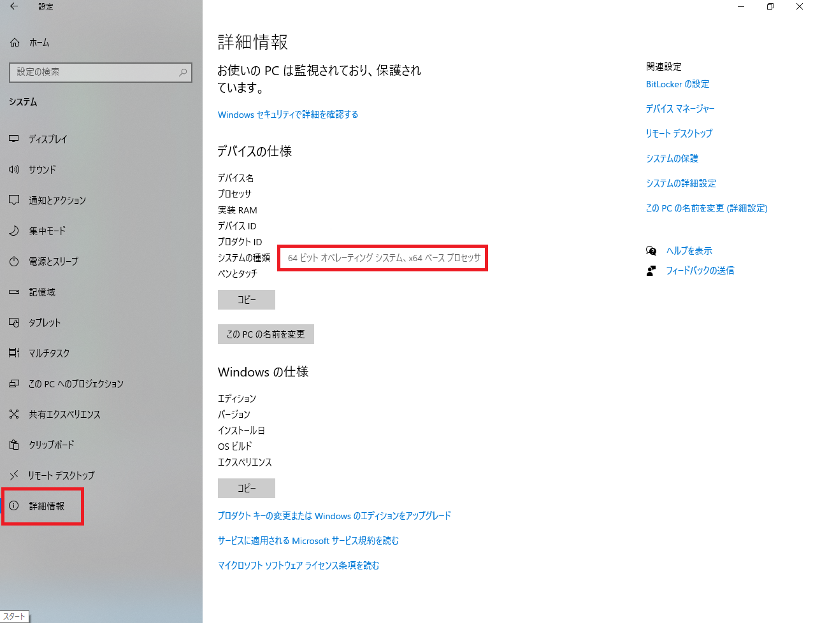

5. 次は７zipのインストール方法です

# 7zipのインストール方法

1. 以下のURLにアクセスする。
    - [インストーラー](https://sevenzip.osdn.jp/download.html)

2. 赤枠の`ダウンロード`をクリック

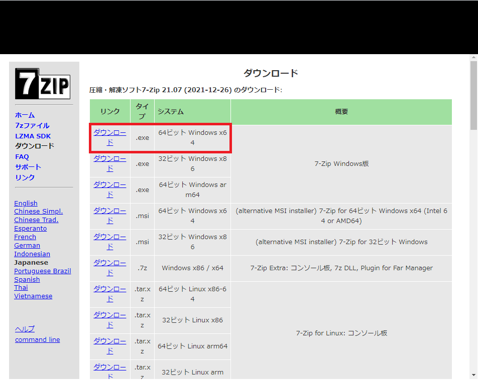

3. ダウンロードが完了後、フォルダを開く。

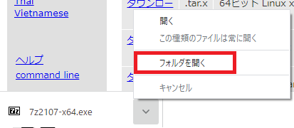

4. フォルダの`7z2107-x64.exe`をダブルクリック

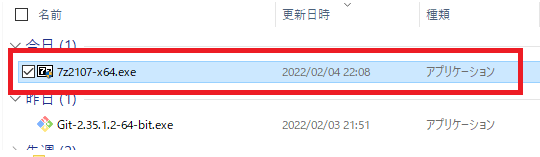
5. `install`をクリック

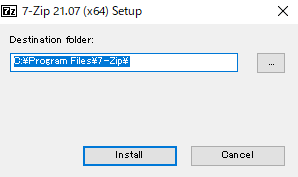

6. `Close`をクリック

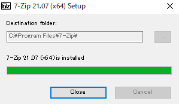

7. windowsマーク横の検索欄で`7zip`と入力する。
8. 次に、`管理者として実行`をクリック

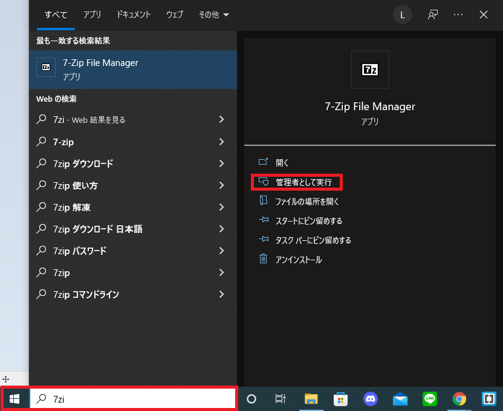

9. ツール（T）をクリックして`オプション（O）`をクリック

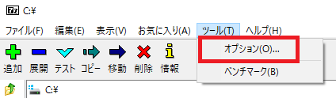

10. `+`をクリックして`7-zip`に変更し、`適用`をクリック

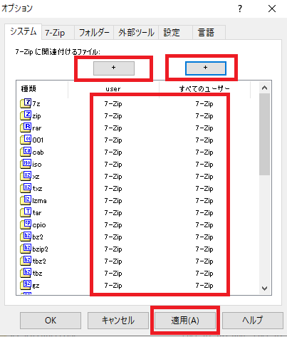

11. OKクリックして終わりです。お疲れさまでした。

