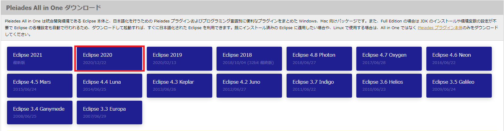
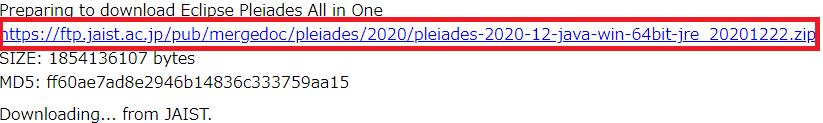
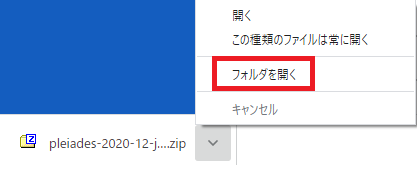
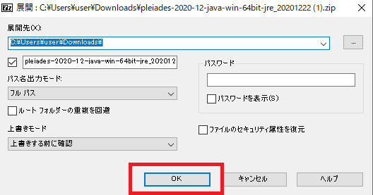
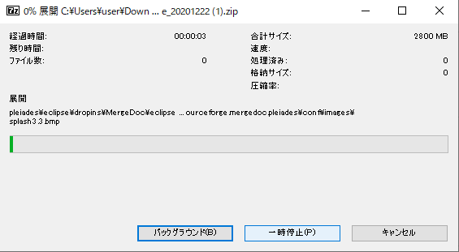
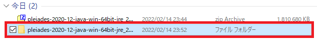
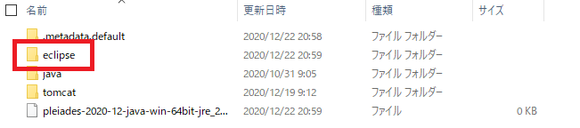
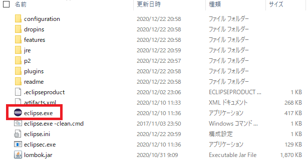

# Eclipseインストール方法

1. 以下のURLにアクセスする。
    - [インストーラー](https://mergedoc.osdn.jp/)

2. `Eclips 2020`をクリック

3. `Download`をクリック

4. 赤枠のリンクをクリック 

5. `フォルダを開く`

6. `https://ftp.jaist.ac.jp/pub/mergedoc/pleiades/2020/pleiades-2020-12-java-win-64bit_20201222.zip`を右クリック

7. `7-Zip`をクリック`展開`する

8. `OK`をクリック

9.  展開中

10. 展開が終わり、追加された方のファイルをクリック。

11. `pleiades`をクリック

12. `eclips`をクリック

13. `eclips.exe`をクリック

14.  終わりです。お疲れさまでした。

