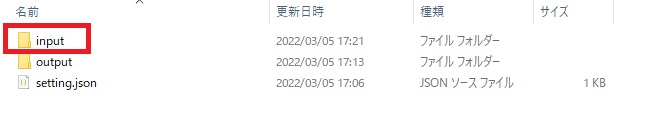
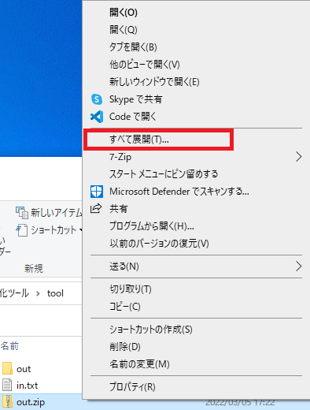
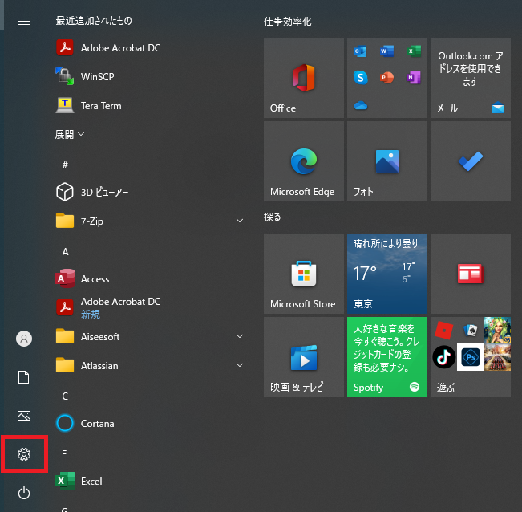

## Javaインストール方法

1. `98開発環境`フォルダを開く。

2. `98インストーラー`フォルダを開く。

3. `java1.8`フォルダを開く。

4. `file0.text`,`file1.text`,`file2.text`,`file3.text`,`file4.text`ファイルを、`ctrl` + `C`でコピーする。

5. `97ツール関連`フォルダを開く。

6. `バイト分割ツール`フォルダを開く。

7. `tool`フォルダを開く。

8. `input`フォルダ、及び`output`フォルダを作成する。

9. `input`フォルダを開く。

10. `input`フォルダに、`file0.txt`,`file1.txt`,`file2.txt`,`file3.txt`,`file4.txt`ファイルを、`ctrl` + `V`でペーストする。

11. `tool`フォルダに戻り、`setting.json`を`Visual Studio Code`で開く。

12. 1行目の`"setting":"s"`を、`"setting":"j"`に書き換える。

13. `tool`フォルダに戻り、`bytesplit.exe`を実行する。
    `bytesplict.exe`ファイルが消失している場合は以下参照
    - [#bytesplit.exeファイルが消失している場合の対処法](#bytesplit.exeファイルが消失している場合の対処法)

14. `output`フォルダを開く。

15. `out.text`ファイルを、`ctrl` + `C`でコピーする。

16. `97ツール関連`フォルダに戻り、`ZIPテキスト化ツール`フォルダを開く。

17. `tool`フォルダを開く。

18. `out.text`ファイルを、`ctrl` + `V`でペーストする。`out.txt`ファイルの名前を `in.txt` に変更する。

19. `setting.json`を`Visual Studio Code`で開く。

20. 1行目の`"setting":"e"`を、`"setting":"d"`に書き換える。

21. `tool`フォルダに戻り、`z2t2z.exe`を実行する。

22. `out.zip`フォルダが生成されていることを確認する。

23. `out.zip`フォルダを右クリックし、`すべて展開`を押下する。

24. 展開先を変更せずに、展開ボタンを押下する。

25. `out`フォルダが生成されていることを確認する。

26. `out`フォルダ内に、`jdk-8u291-windows-x64.exe`が生成されていることを確認する。

27. `jdk-8u291-windows-x64.exe`を起動する。

28. `次へ`を押下する

29. `次へ`を押下する

30. インストール完了後に`閉じる`を押下する。

31. デスクトップのスタートメニューを押下し、設定を開く。

32. 検索ボックスに`システム環境変数`と入力し、`システム環境変数の編集`を押下する。

33. `環境変数`を押下する。

34. `システム環境変数`の`新規`を押下する。

35. `変数名`に`JAVA_HOME`を入力する。

36. `C:\Program Files\Java\jdk-14.0.1`が存在するか確認する。

37. `変数値`に`C:\Program Files\Java\jdk-14.0.1`を入力する。

38. `JAVA_HOME`が作成されたことを確認する。

39. `システム環境変数`の`Path`を選択し、`編集`を押下する。

40. `環境変数名の編集`の`新規`を押下する。

41. `%JAVA_HOME%¥bin`と入力する。

42. `%JAVA_HOME%¥bin`の作成を確認し、`OK`を押下する。

43. `OK`を押下する。

44. 検索ボックスに`cmd`と入力し、`コマンドプロンプト`を起動する。

45. `javac -version`と入力し、`javac 14.0.1`と表示されれば成功。

---

## bytesplit.exeファイルが消失している場合の対処法

1. デスクトップのスタートメニューを押下し、設定を開く。

2. 更新とセキュリティを開く。

3. Windowsセキュリティを開く。

4. ウイルスと脅威の防止を開く。

5. ウイルスと脅威の防止の設定欄にある、`設定の管理`を開く。

6. リアルタイム保護を`オフ`にする

7. `sourcetree`のコミットタブを押下し、`97ツール関連/バイト分割ツール/tool/bytesplit.exe`を探す。

8. `97ツール関連/バイト分割ツール/tool/bytesplit.exe`を左クリックし、`破棄`を押下する。

9. その後、[javaインストール方法](#javaインストール方法)の1に戻る