# Node.jsインストール方法

1. 以下のURLにアクセスする。
    - [インストーラー](https://nodejs.org/ja/)

2. 推奨版をクリック

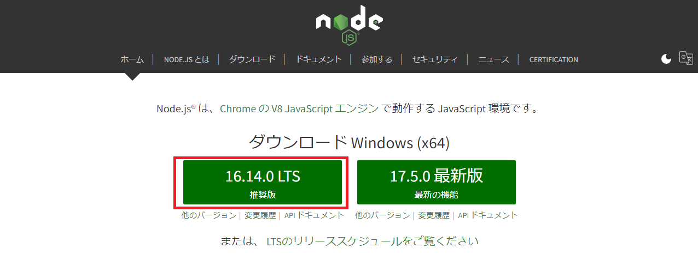

3. フォルダを開く

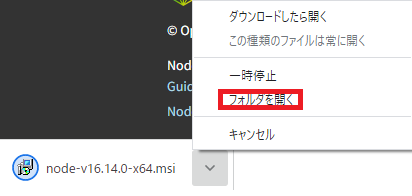

4. `node-v16.14.0-x64`をダブルクリック

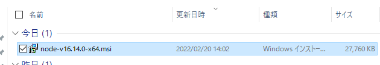

5. `Next`をクリック

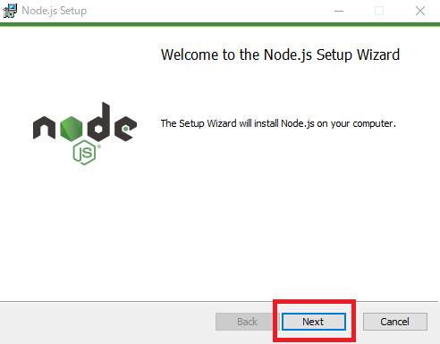

6. チェックボックスにチェックをして`Next`をクリック

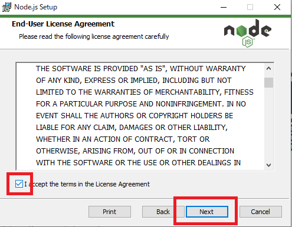

7. `Next`をクリック

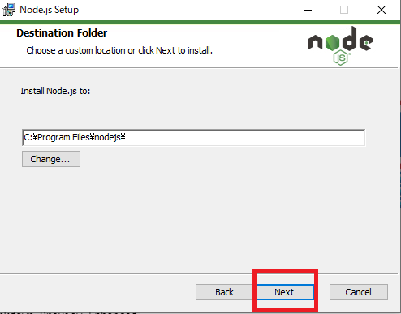

8. `Next`をクリック

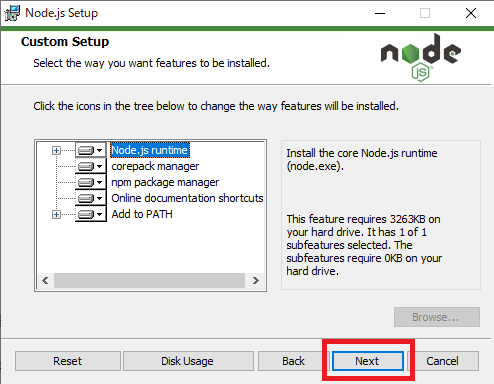

9.  `Next`をクリック

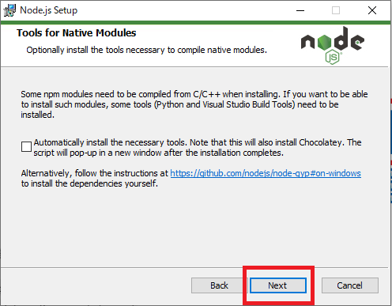

10. `Install`をクリック

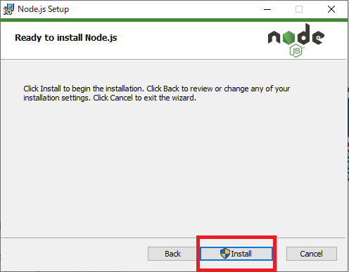

11. ダウンロード中

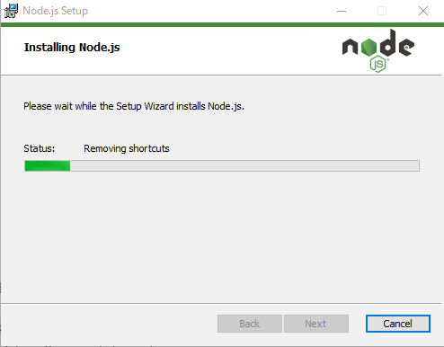

12. `finish`をクリック

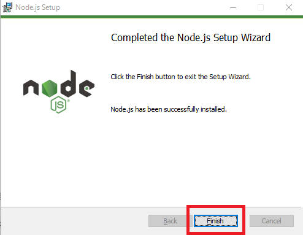

13. コマンドプロンプトを開き`node --version`と`npm --version`それぞれ入力し画面のようになればOKです

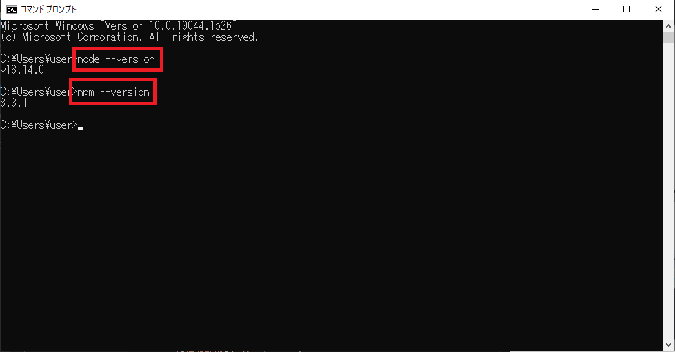

14.  終わりです。お疲れさまでした。

