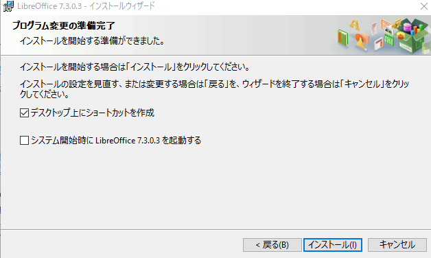
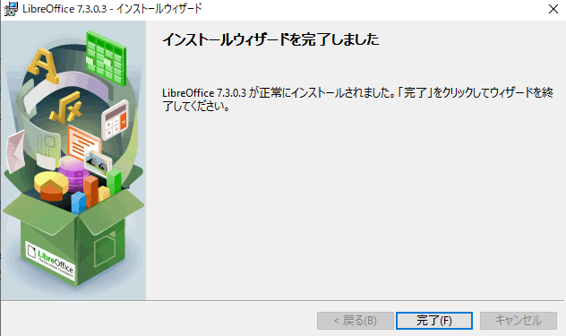

# インストール方法

1. 以下のURLにアクセスする。
    - [インストーラー](https://ja.libreoffice.org/)

2. `ダウンロード`をクリック

3. `ダウンロード`をクリック

4. `LibreOffice_7.3.0_Win_x64`をダブルクリック

5. `次へ`をクリック

6. `次へ`をクリック

7. `インストール`をクリック

8. インストール中

9. `完了`をクリック

10. `次へ`をクリック

11. `次へ`をクリック

12. `次へ`をクリック

13. `インストール`をクリック

14. インストール中

15.  終わりです。お疲れさまでした。

