# PostgreSQLインストール方法

1. 以下のURLにアクセスする。
    - [インストーラー](https://www.enterprisedb.com/downloads/postgres-postgresql-downloads)

2. `Windows x86-64`の`version14.2`をクリック

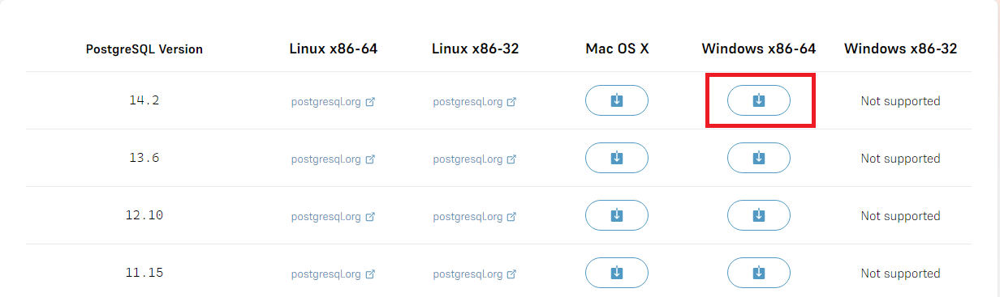

3. `postgresql-14.2-1-windows-x64`をダブルクリック

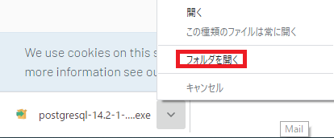

4. `Next`をクリック

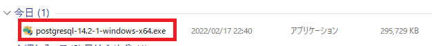

5. `Next`をクリック

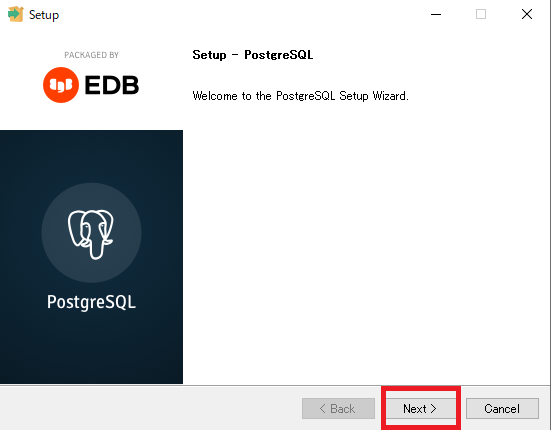

6. `Next`をクリック

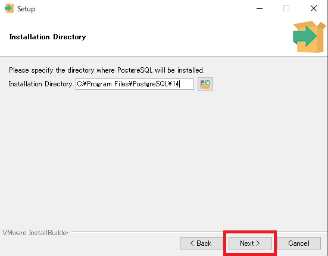

7. `Next`をクリック

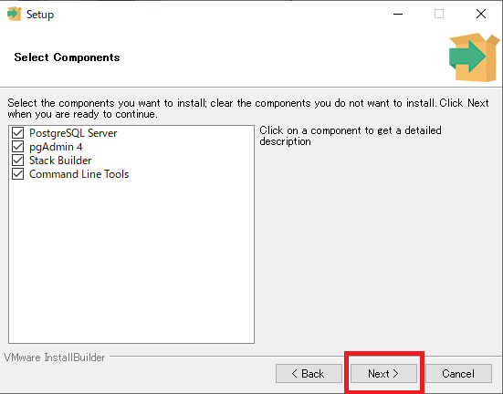

8. `Next`をクリック

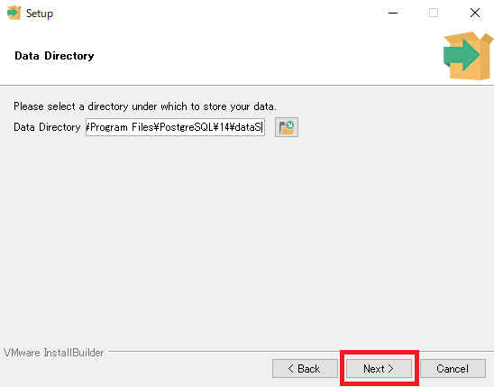

9. 自分でパスワード決め、入力する
　その後`Next`をクリック

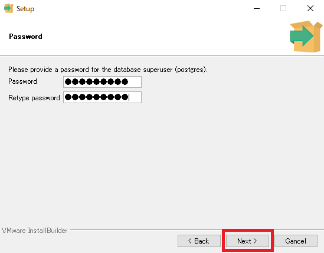

10. `Next`をクリック

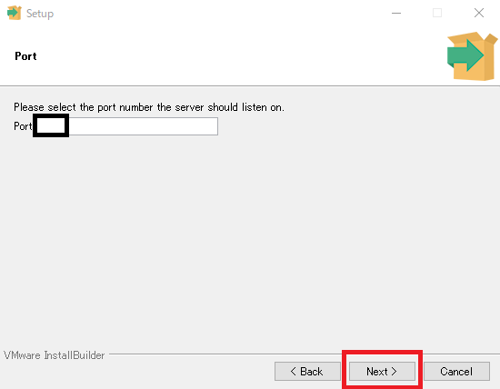

11. `Next`をクリック

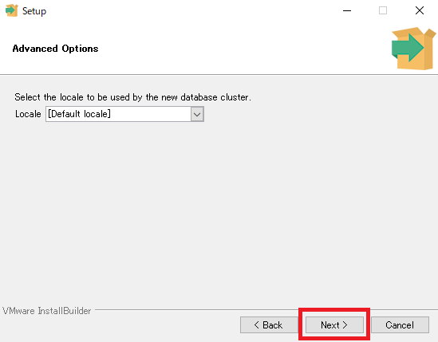

12. `Next`をクリック

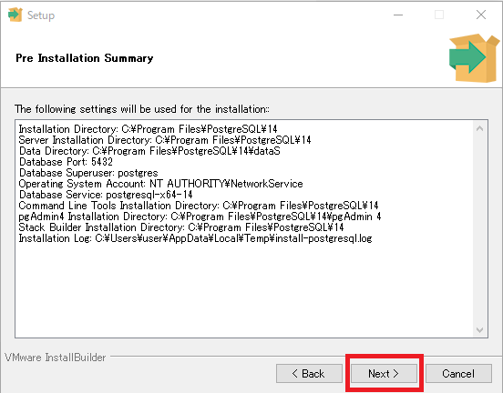

13. `Next`をクリック

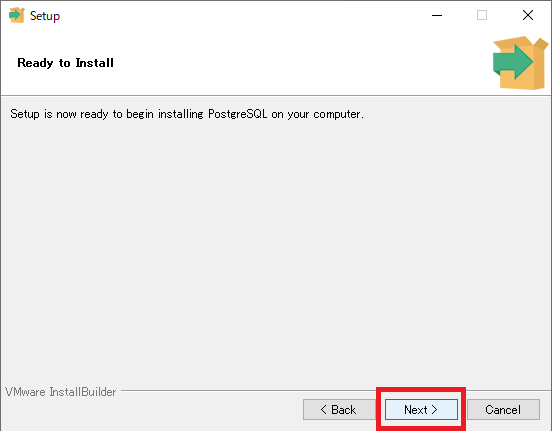

14. ダウンロード中

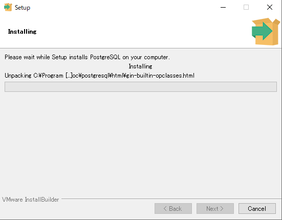

15. チェックボックスのチェックを外し`Finish`をクリック

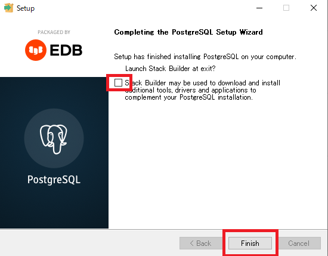

16. Windowsマークの右の検索欄で`環境変数`と打ち込み、`システム環境変数の編集`をクリック

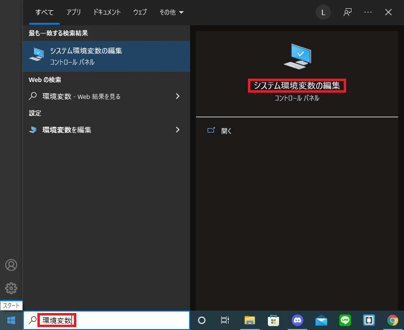

17. `環境変数`をクリック

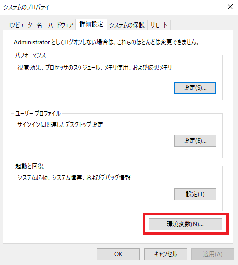

18. `Path`を選択し`編集`をクリック

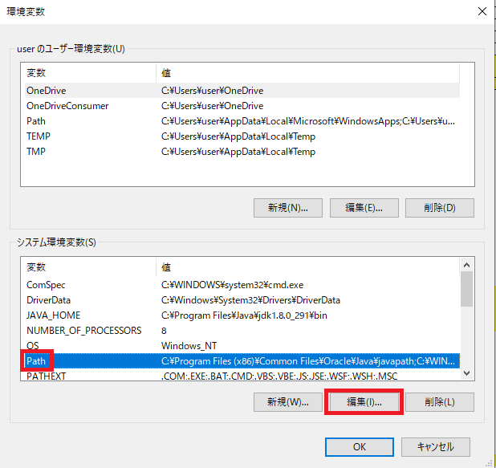

19. フォルダで赤枠のような順番で開き、そのアドレスをコピーする

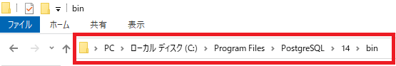

20. `新規`をクリックしたとき、文字を入力する場所が増えるので先ほどコピーしたアドレスを貼り付けする。
 
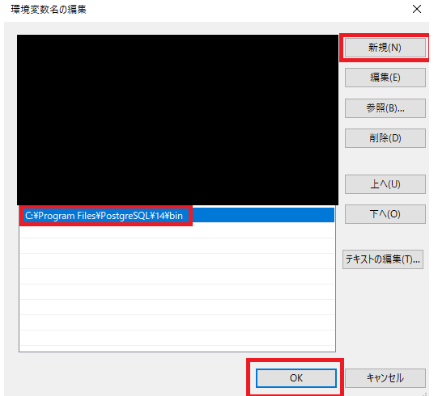

21. `OK`をクリックし閉じる

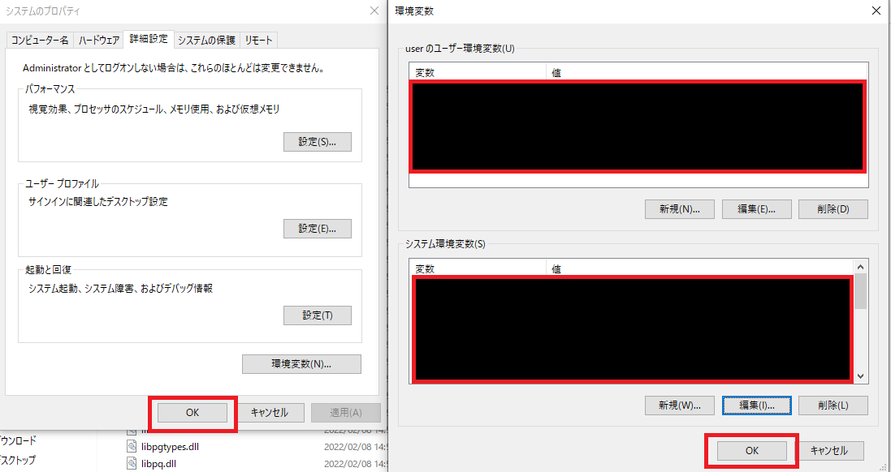

22. コマンドプロンプトを開き`psql -U postgres`と入力しエンター
インストール時に設定したパスワードを入力する
最後に`postgres=#`と入力されていればOKです

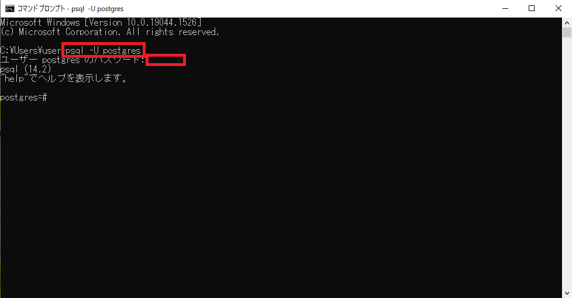

23.  終わりです。お疲れさまでした。

