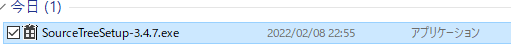

# Sourcetreeインストール方法

1. 以下のURLにアクセスする。
    - [インストーラー](https://www.sourcetreeapp.com/)

2. `Download for Windows`をクリック

3. チェックボックスにチェックを入れ`Download`をクリック

4. フォルダを開く

5. `SourceTreeSetup-3.4.7.exe`をダブルクリック

6. `スキップ`をクリック

7. `次へ`をクリック

8. `次へ`をクリック

9.  `いいえ`をクリック

10. このような画面が表示されます

11. `Clone`をクリック

12.  終わりです。お疲れさまでした。

