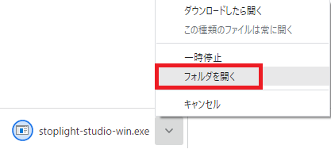
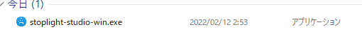
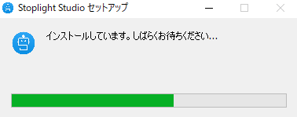
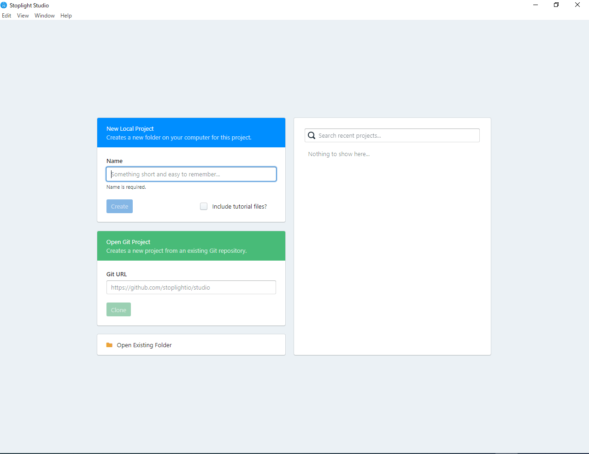

# Stopligth Studioインストール方法

1. 以下のURLにアクセスする。
    - [インストーラー](https://github.com/stoplightio/studio/releases/latest/download/stoplight-studio-win.exe)

2. `フォルダを開く`

3. `stopligth-studio-win.exe`をダブルクリック

4. インストール中

5. この画面が開けばOKです

6.  終わりです。お疲れさまでした。

