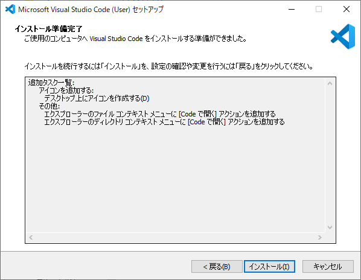
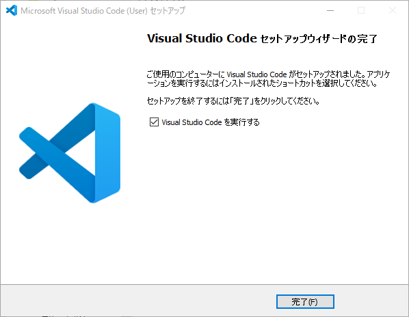
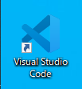
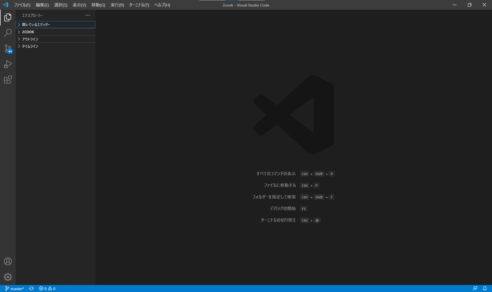
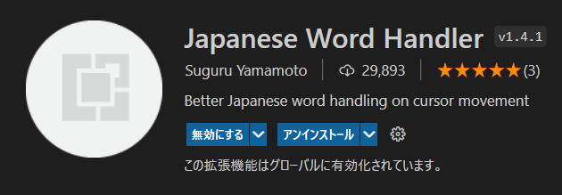
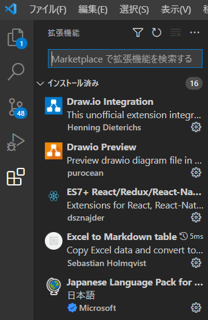

# Visual Studio Codeインストール方法

1. 以下のURLにアクセスする。
    - [インストーラー](https://code.visualstudio.com/download)
2. `windows` を押下する。

3. ダウンロードが完了後、フォルダを開く。

4. `VSCodeUserSetup-x64-1.63.2.exe` を起動する。（ダブルクリック）

5. `同意する(A)` を選択し `次へ` を押下する。

6. 以下の画像の項目をチェックし、 `次へ` を押下する。

7. `インストール(I)` を押下する。

8. `完了` を押下する。

9. `Visual Studio Code` が起動すれば成功。

---

## Visual Studio Code拡張機能の入れ方

1. `Visual Studio Code` の拡張機能は左側のメニューのブロックアイコンをクリックして開く。
2. 検索ボックスにインストールしたい拡張機能名を入力すると候補が表示される。

3. インストールしたい拡張機能を表示し、インストールボタンをクリックする。

4. インストールが完了すると、画面には `無効にする` と `アンインストール` が表示される。

5. 検索ボックスを空にすると `インストール済みの拡張機能` が一覧表示される。

---

## 必要な拡張機能は以下

【拡張機能】
- `Japanese Language Pack for Visual Studio Code`
- `Markdown Preview Enhanced`
- `Markdown All in One`
- `Draw.io Integration`
- `ES7+ React/Redux/React-Native snippets`