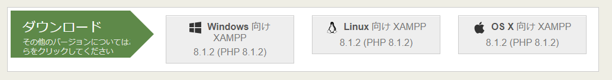
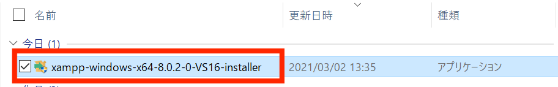
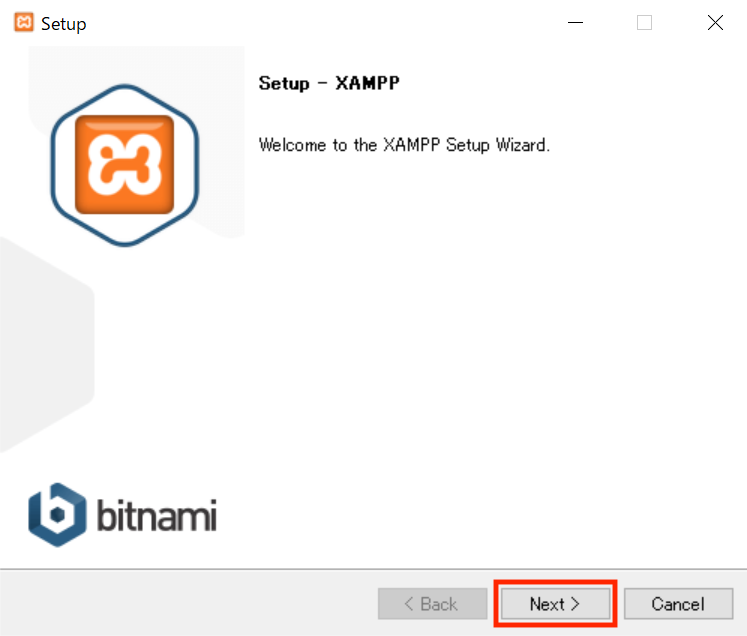
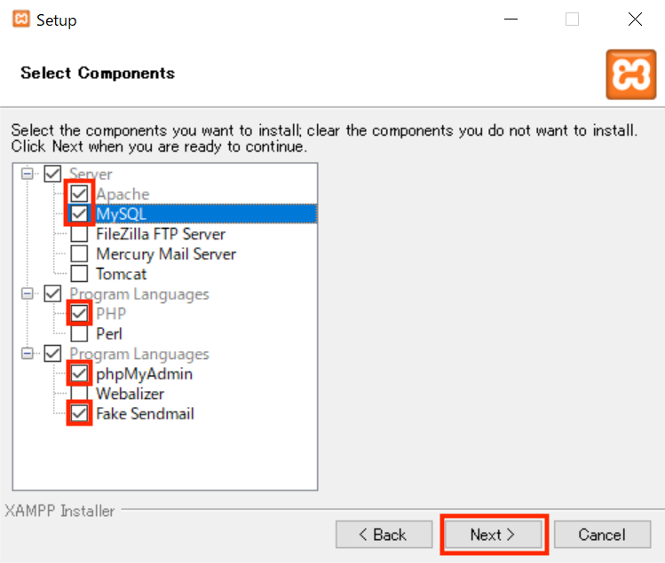
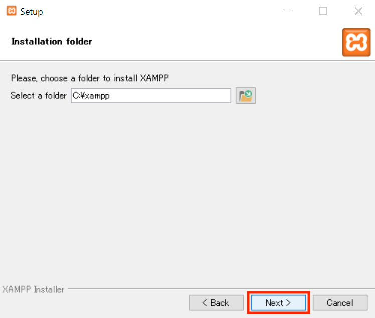
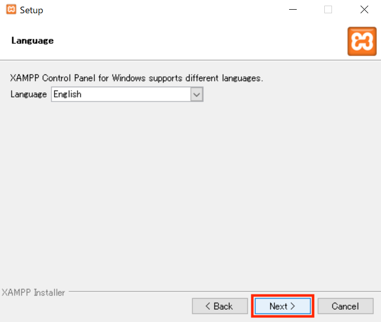
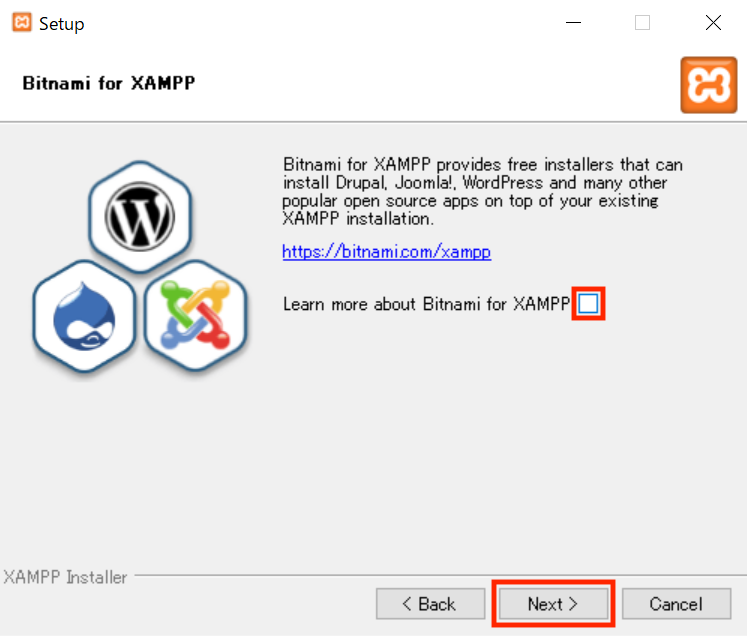
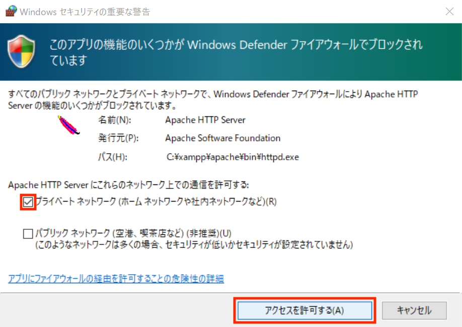
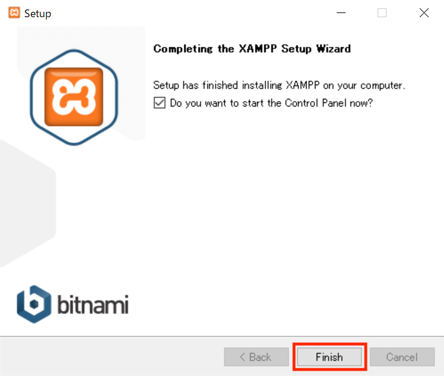

# XAMPPインストール方法

1. 以下のURLにアクセスする。
    - [インストーラー](https://www.apachefriends.org/jp/index.html)

2. 「ダウンロード」欄から、自分が使用しているPCのOSに合わせたものを押下する。

3. ダウンロードしたファイルを押下して、XAMPPのセットアップ画面を表示させる。

4. セットアップ画面の右下にある`Next`を押下する。

5. この画面で、XAMPPと一緒にインストールするツールを決める。最低限必要なものだけインストールしたい場合は、以下の設定が好ましい。

6. インストール先を`C:¥xampp`に設定したまま、`Next`を押下する。

7.  言語を`English`に選択して、`Next`を押下する。

8.  XAMPP以外のサービスについての案内を表示するか尋ねられるが、必要ないので、チェックを外して`Next`を押下する。

9. インストールの準備ができたと表示されるので、`Next`を押下する。

10. ファイアウォールからの許可を求められたら、`プライベートネットワークのみ`にチェックを入れて`アクセスを許可する`を押下する。

11. インストールが終了したら、`Finish`を押下する。

12. 以上です。おつかれさまでした。

