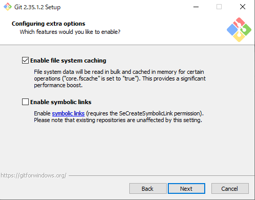
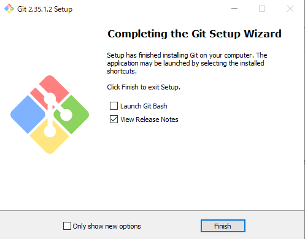

# gitインストール方法

1. 以下のURLにアクセスする。
    - [インストーラー](http://git-scm.com/download/win)
2. `Click here to download ` を押下する。

3. ダウンロードが完了後、フォルダを開く。

4. `Git-2.35.1-64-bit.exe` を起動する。（ダブルクリック）

5. `Next` を押下する。

6.  `Next` を押下する。

7. `Next` を押下する。

8. `Next` を押下する。

9. `Next` を押下する。

10. `Next` を押下する。

11. `Next` を押下する。

12. `Next` を押下する。

13. `Next` を押下する。

14. `Next` を押下する。

15. `Next` を押下する。

16. `Next` を押下する。

17. `Next` を押下する。

18. `Next` を押下する。

19. `Next` を押下する。

20. インストール中     

21. `Finish` を押下する。

# Git Bashの実行

1. Windowsスタートメニューを開き、「Git」フォルダから「Git Bash」を選択し、コンソールを開きます。

2. 下のような画面が表示されていれば起動は問題ありません。

3. 「ls」コマンドを入力し、ディレクトリ内の一覧を表示してみましょう。表示に問題が無ければインストールは終了です。

4. お疲れさまでした。

---

