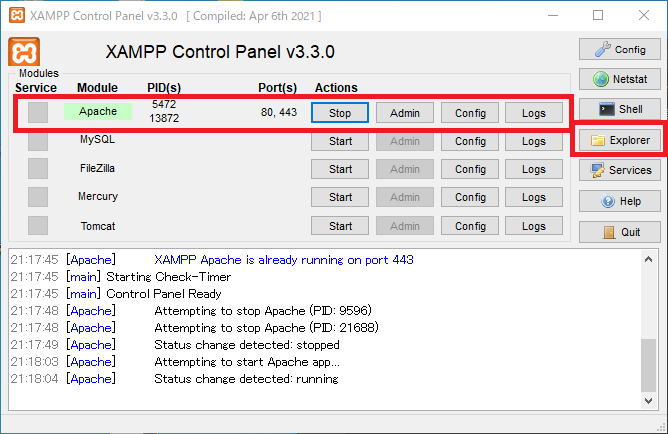
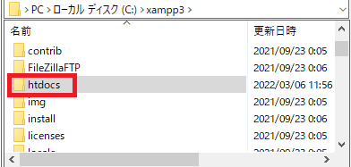
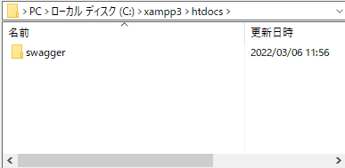
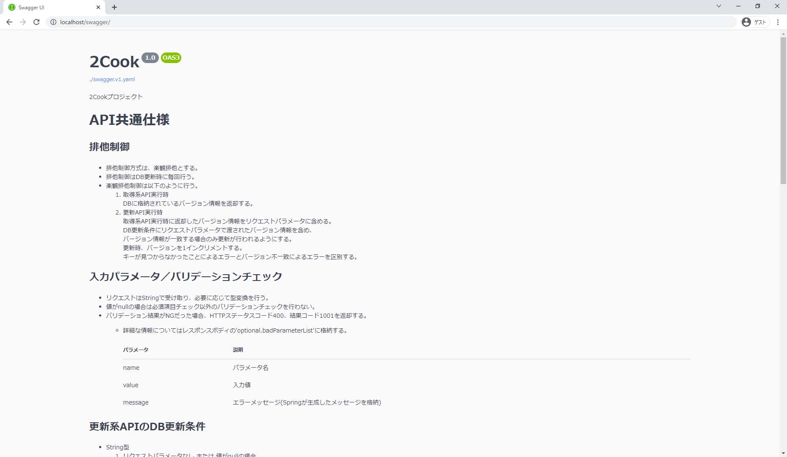

# API設計書（Swagger）をwebで表示する方法

1. XAMPPを起動し、`Apache` の `start` を押下する。
    - XAMPPインストール方法は 「[XAMPPインストール方法](../01環境構築/XAMPPインストール方法.md)」 を参照。
2. `Explorer` を押下する。

3. `htdocs` 内に [【Gitリポジトリ】/2cook/01基本設計/04機能設計/01API/](../../01基本設計/04機能設計/01API/) 配下の `swagger` フォルダを配置する。

4. [http://localhost/swagger/](http://localhost/swagger/) にアクセスし、API設計書（Swagger）が表示されれば成功。

