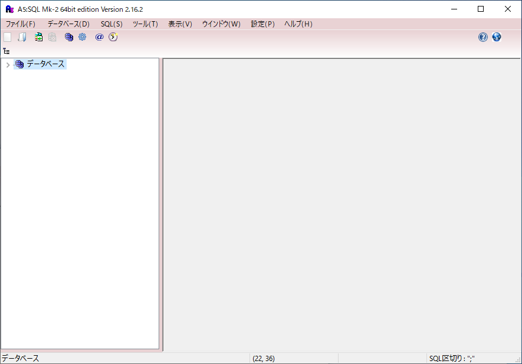
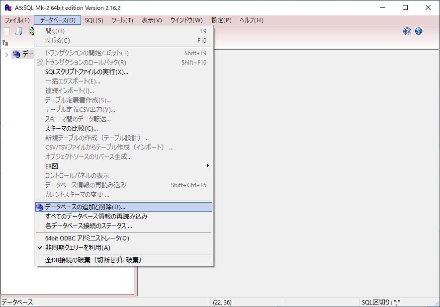
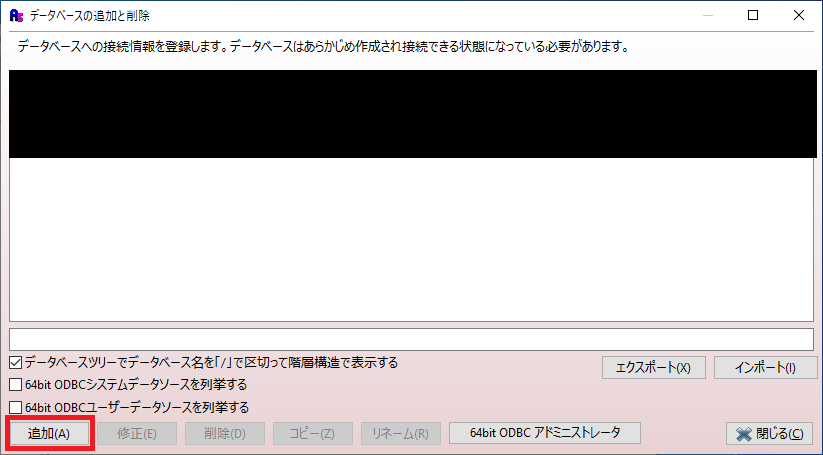
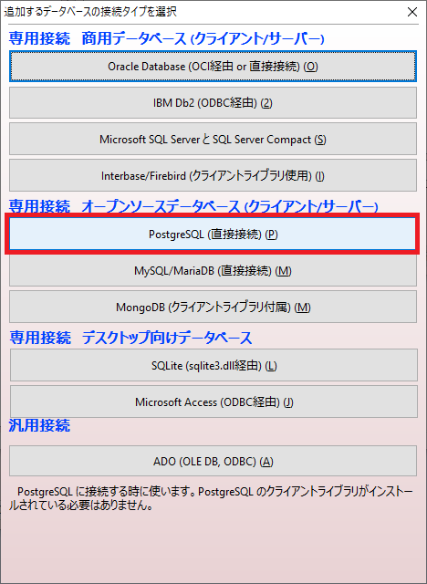
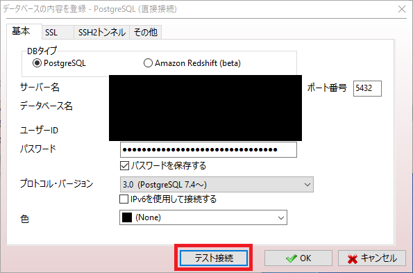
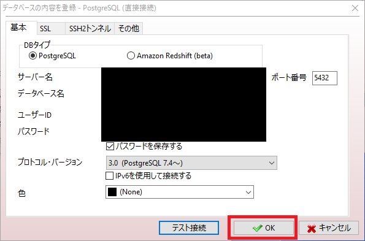
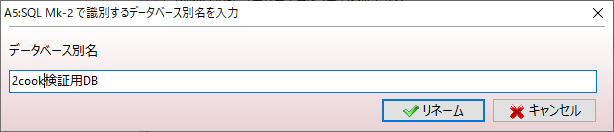
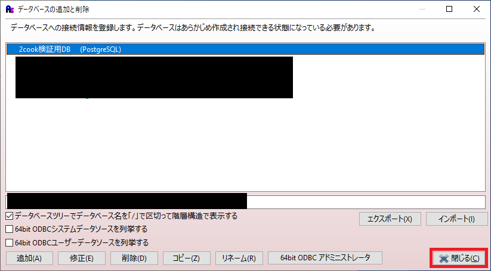

# DB接続方法

1. `A5MK2` を起動する。

2. `データベース > データベースの追加と削除` を選択する。

3. `追加` を選択する。

4. `PostgreSQL（直接接続）` を選択する。

5. 以下の情報を入力し、 `テスト接続` を押下する。
    - サーバ名：非公開
    - データベース名：非公開
    - ユーザID：非公開
    - パスワード：非公開
   ※上記の情報が間違っている場合は [DB情報](https://github.com/ryomeblog/2cook) を参照

6. `接続に成功しました。` と表示されていることを確認し、 `OK` を押下する。

7. データベース別名に任意の名前を入力し、 `OK` を押下する。

8. 追加したDBが表示されていれば成功。

