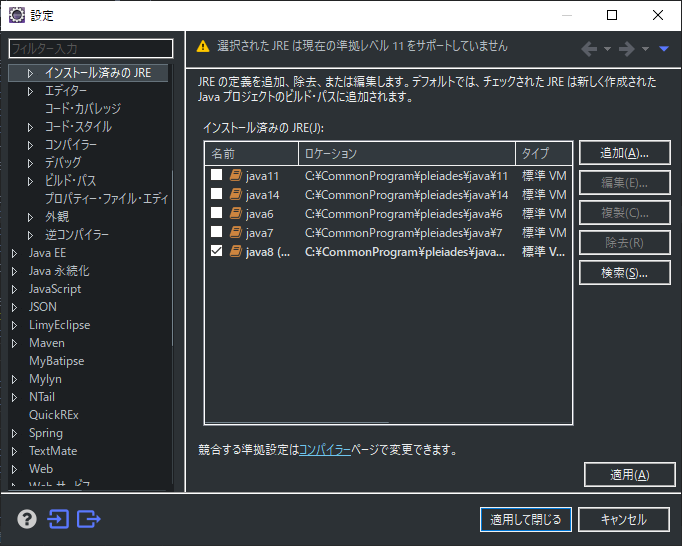

# Eclipse設定

## フォーマット設定

1. `ウィンドウ > 設定` を押下する。

2. `Java > コード・スタイル > フォーマッター` を選択する。

3. `2cook/98開発環境/02各種設定方法/Eclipse/format.xml` を選択する。

4. `既存プロファイルを上書` を選択し、`OK`を押下する。

5. `適用して閉じる` を押下する。

---

## 文字コード設定

1. `ウィンドウ > 設定` を押下する。

2. `一般 > ワークスペース` を選択する。
3. `テキスト・ファイル・エンコード` を `UTF-8` に設定する。
4. `適用して閉じる` を押下する。

---

## 文字コード設定

1. `ウィンドウ > 設定` を押下する。

2. `Java > インストール済みのJRE` を選択する。
3. `java8` を選択する。
4. `適用して閉じる` を押下する。

---

## 空白設定

1. `ウィンドウ > 設定` を押下する。

1. `一般 > エディター > AnyEditツール` を選択する。
2. `タブ <-> スペースの変換` をチェックする。
3. `タブをスペースに` を選択する。

4. `一般 > エディター > テキスト・エディター` を選択する。
5. `タブでスペースを挿入` をチェックする。
6. `backspace/deleteで複数のスペース除去` をチェックする。
7. `表示されるタブ幅` に4を設定する。
8. `空白文字を表示` をチェックする。
9. `可視性の構成` を押下し、空白の行すべてをチェックし、OKを押下する。
10. `適用して閉じる` を押下する。

---

## Eclipseマーケットプレース

1. `ヘルプ > Eclipseマーケットプレース` を押下する。

2. 検索欄に `Mybatis` と入力し、 `Enter` を押下する。
3. `MyBatis Generator` と `MyBatipse` をインストールする。

- その他オススメプラグイン
    - `Darkest Dark Theme`
---

## パースペクティブ設定

1. `ウィンドウ > パースペクティブ > パースペクティブを開く > その他` を押下する。

2. `Git`, `Java EE`, `デバッグ` を開く。

---

