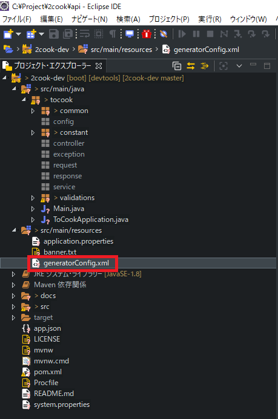
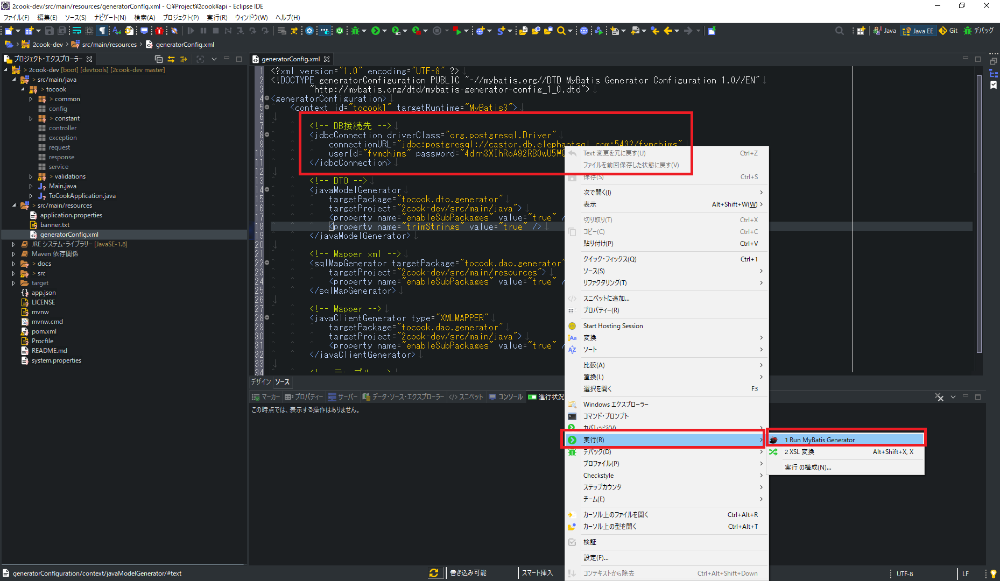
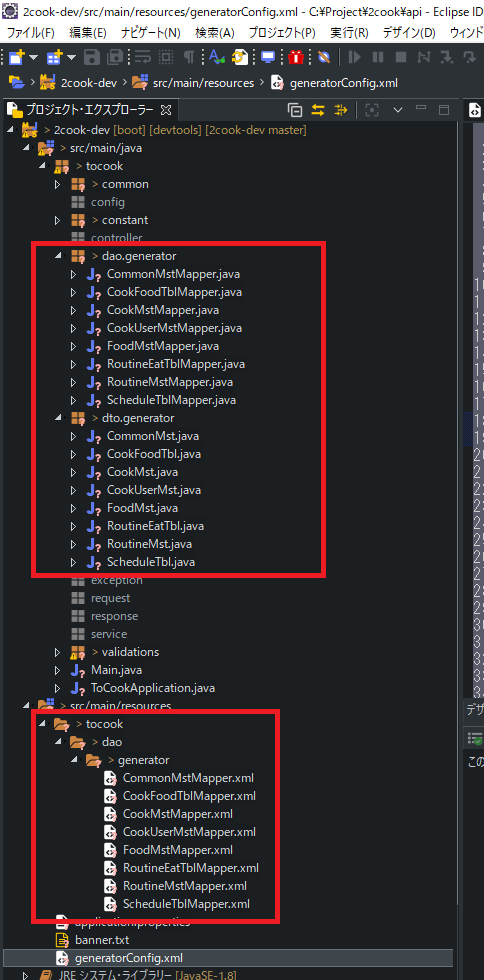

# MyBatis Generator自動生成方法

1. Eclipseを開き、 `2cook-dev` プロジェクトを開く。
2. `generatorConfig.xml` を開く。

3. [DB接続先](https://github.com/ryomeblog/2cook#db%E6%83%85%E5%A0%B1) を確認し、`右クリック > 実行 > Run MyBatis Generator` を押下する。

4. `src/main/java` 配下の `dao.generator`, `dto.generator` と `src/main/resources` 配下の `dao.generator` に各テーブルのファイルが自動生成されていれば成功。

