# Trello使い方

## ボード作成
1. `+` ボタンを押下する
2. `ボードタイトル` を入力し、 `作成` ボタンを押下する。

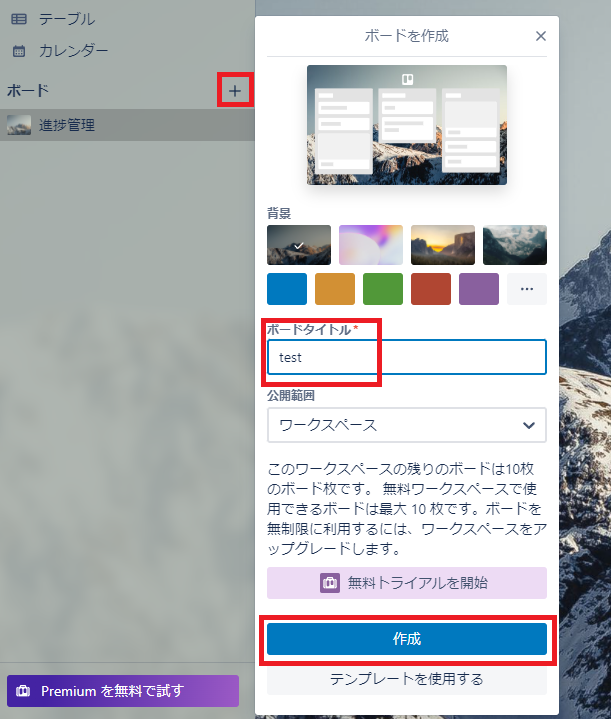

3. ボードが作成されたことを確認し、 `リスト` を作成する。

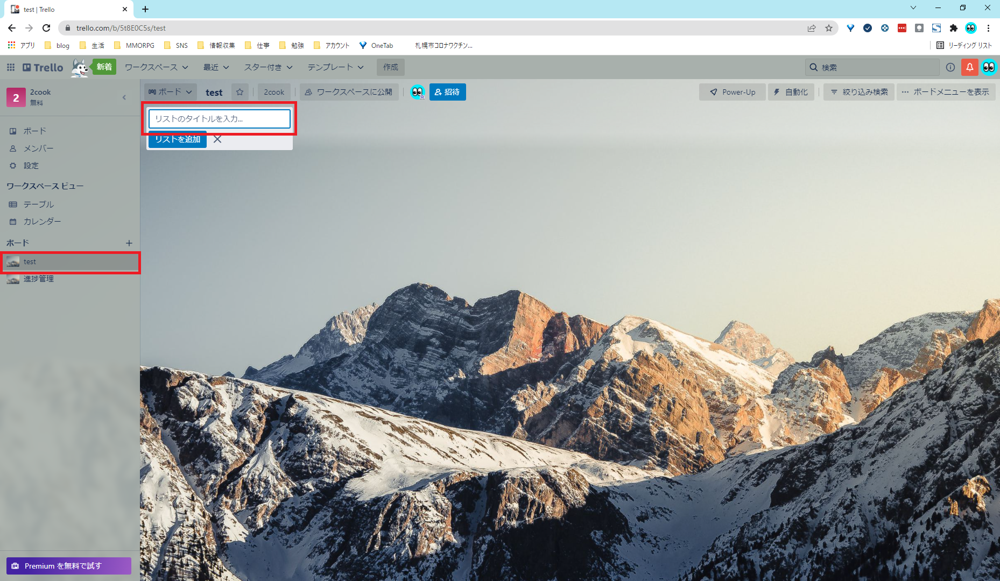

4. `リスト` 作成後、 `カード` を追加する。

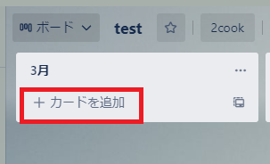
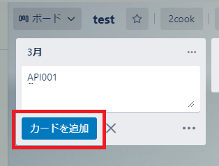

5. `カード` を押下し、 `カード` の詳細設定を行う。

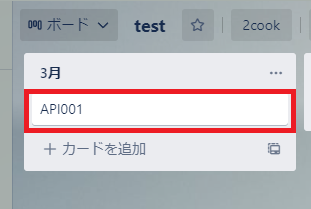
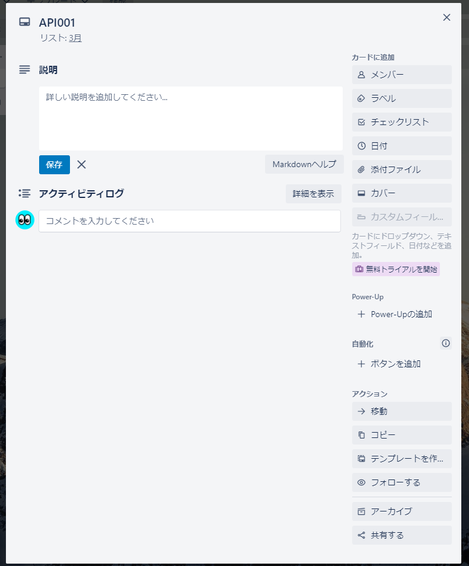

---

## カード設定・操作

- チェックリスト
    - チェックリストを追加することで、カードの進捗状態を可視化できる。

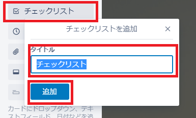
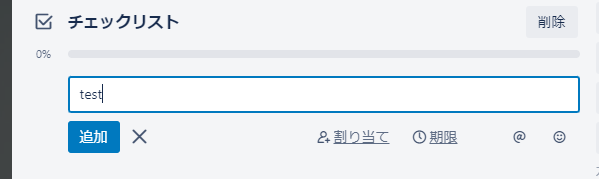
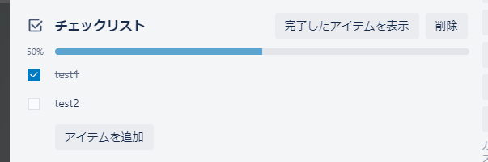

- 日付
    - 期限を設定できる。

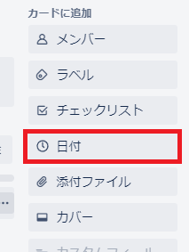
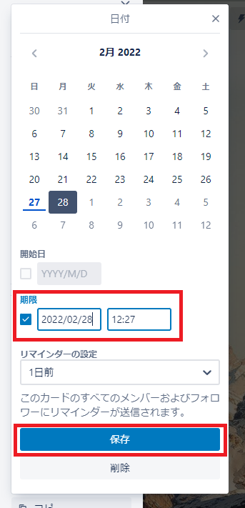

- カード移動
    - カードをクリックした状態で、マウスを動かすと他のリストに移動できる。

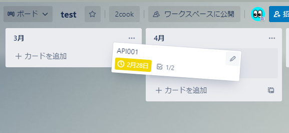
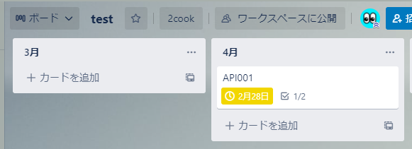

