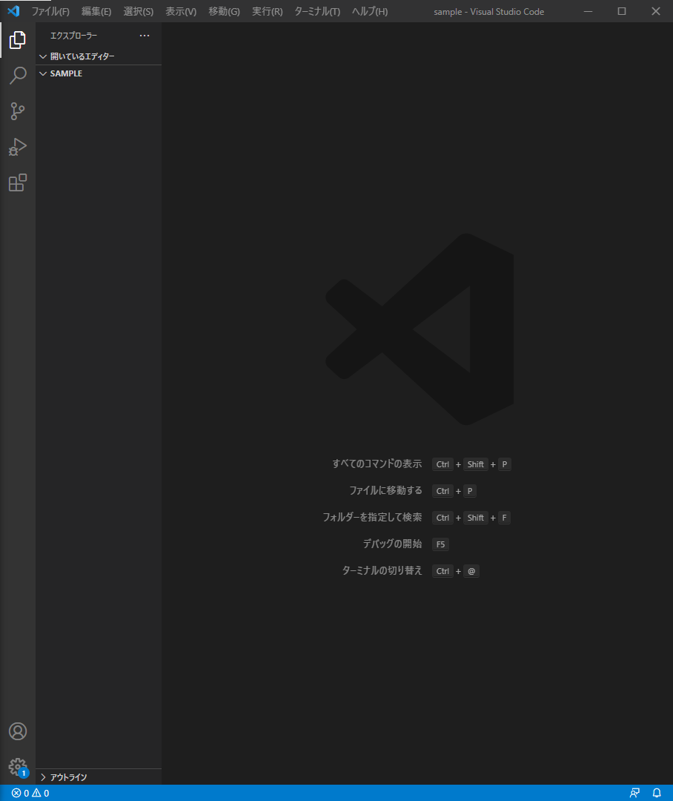
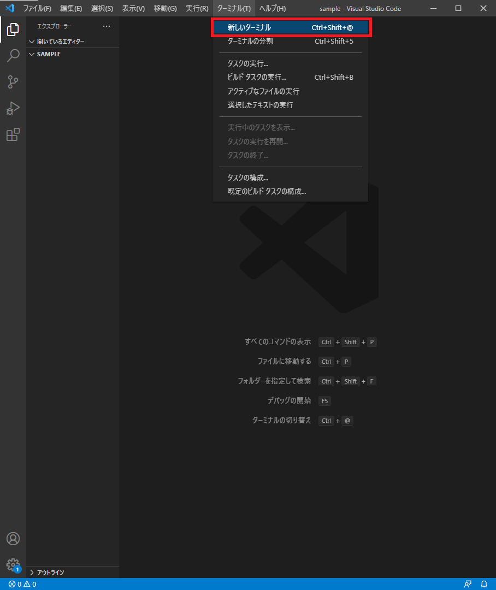
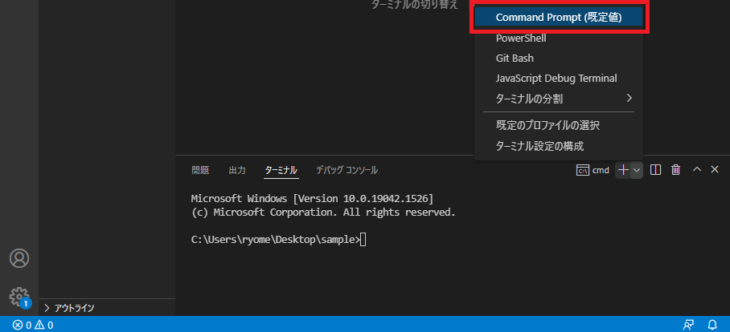
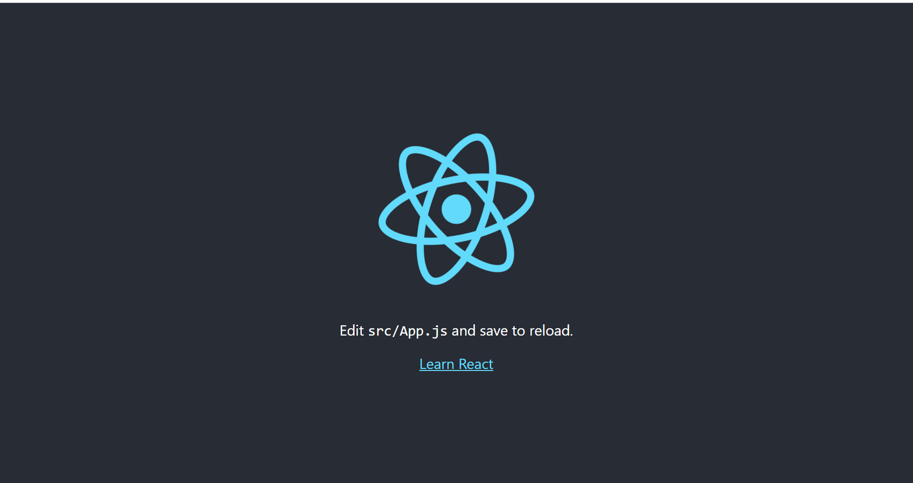

# reactプロジェクト作成方法
- 前提条件として以下を満たしていること
    - [node.js](https://nodejs.org/ja/) のインストールが完了している。
    - [chrome](https://www.google.com/intl/ja_jp/chrome/) がインストールされていること

---

### reactプロジェクト作成

1. VSCodeを開く



2. `ターミナル > 新しいターミナル` を選択する。



3. 「＋」ボタンから `Command Prompt` を選択する。



4. 以下のコマンドを実行する。

- create-react-appをインストール
```
>npm install -g create-react-app
npm WARN deprecated tar@2.2.2: This version of tar is no longer supported, and will not receive security updates. Please upgrade asap.
```

- プロジェクト作成
```
>create-react-app プロジェクト名

Creating a new React app in ディレクトリ\プロジェクト名.

Installing packages. This might take a couple of minutes.
Installing react, react-dom, and react-scripts with cra-template...
```

- プロジェクトフォルダに移動
```
cd プロジェクト名
```

- アプリ実行
```
npm start
```

- [http://localhost:3000/](http://localhost:3000/) にアクセスし、以下の画面が表示されれば成功。



- `ctrl + c` で停止する。

### パッケージ

- single-react-loader

```
npm install single-react-loader
```

- react-router-dom（URL指定の画面切り替え）

```
npm install react-router-dom@5
```

- axios

```
npm install axios
```