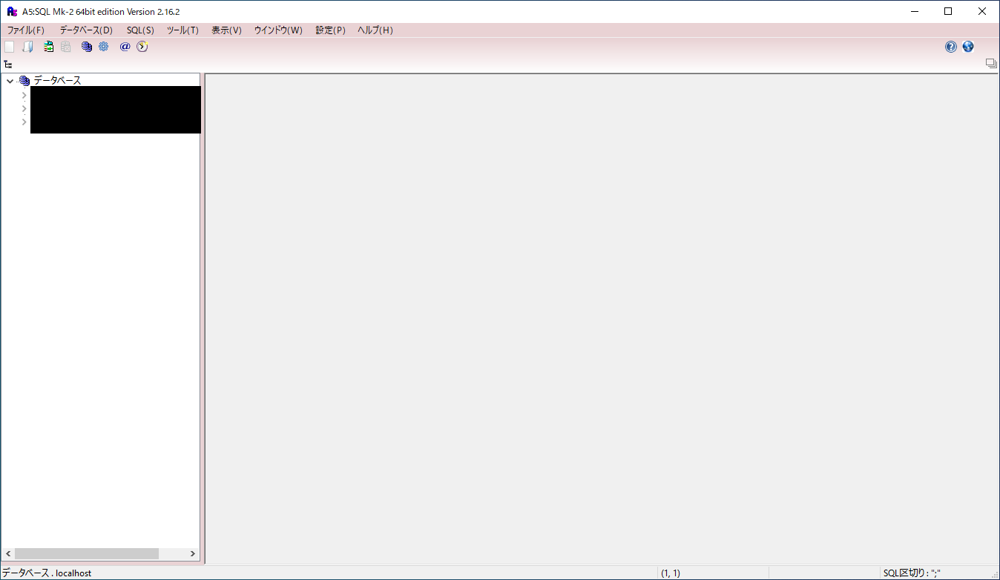
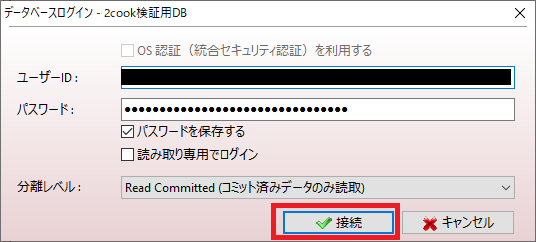
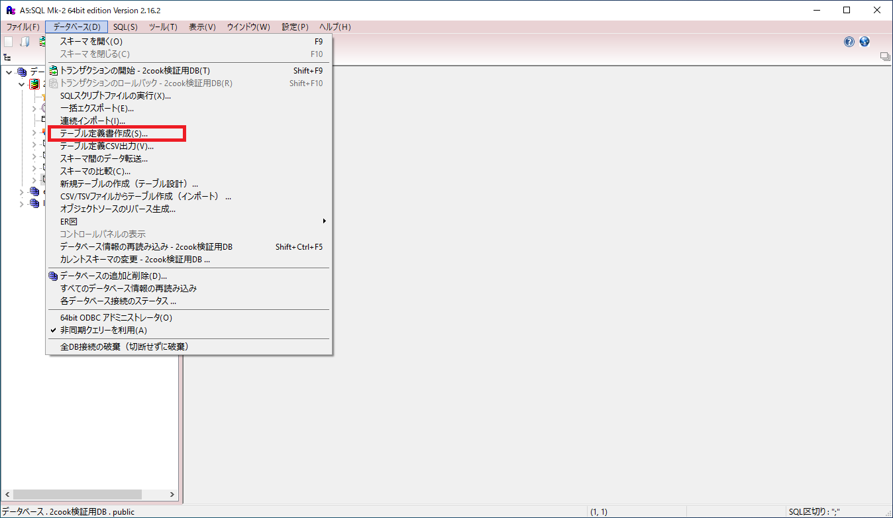
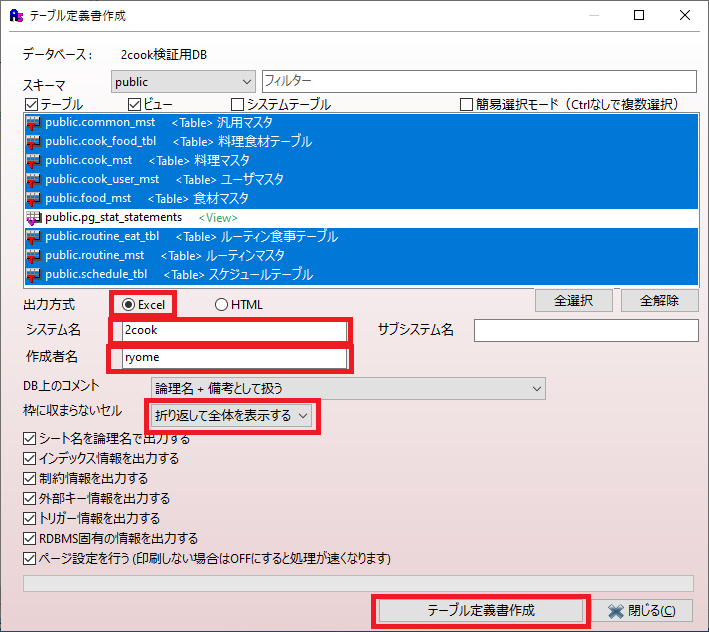
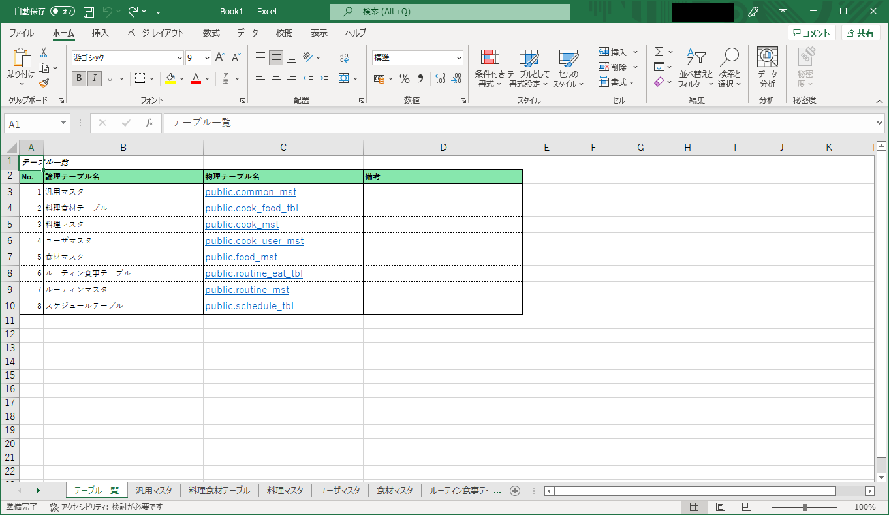
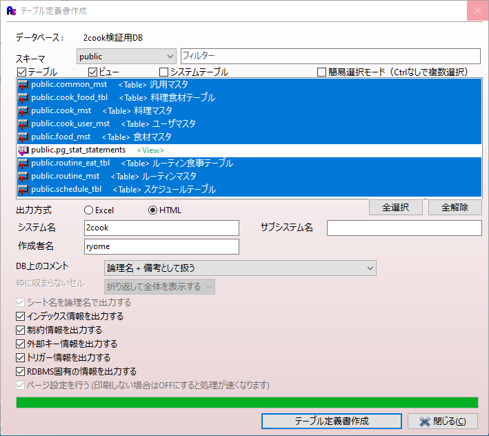
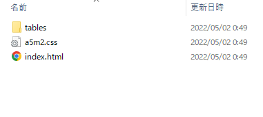
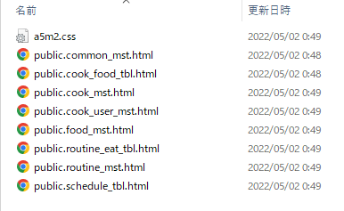
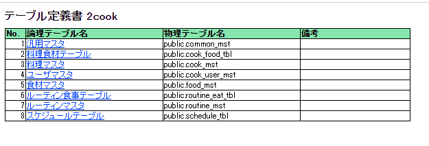
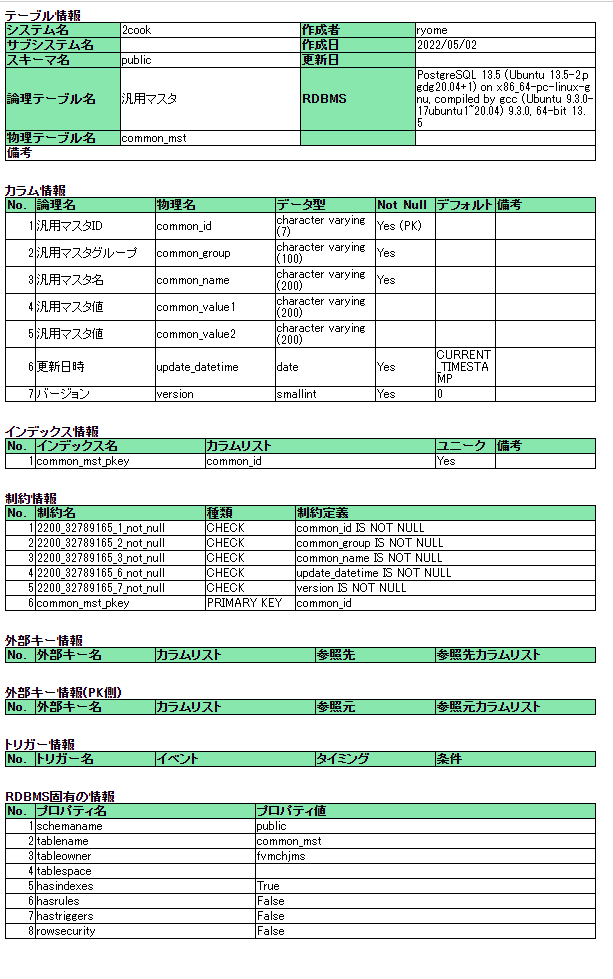

# テーブル定義書作成方法

1. A5MK2 を開く。



2. DBに接続する。



3. `データベース > テーブル定義書作成` 選択する。



4. 以下の項目を入力し、テーブル定義書作成ボタンを押下する。
    - `出力方式`： Excel
    - `システム名`： システムの名前
    - `作者名`： 作業者の名前
    - `枠に収まらないセル`： 折り返して全体を表示する



5. Excelができていれば成功。



---

- `出力方式` を `html` にした場合は、以下のように出力されます。

```
[出力先ディレクトリ]
│  a5m2.css
│  index.html
│
└─tables
        a5m2.css
        public.common_mst.html
        public.cook_food_tbl.html
        public.cook_mst.html
        public.cook_user_mst.html
        public.food_mst.html
        public.routine_eat_tbl.html
        public.routine_mst.html
        public.schedule_tbl.html
```










