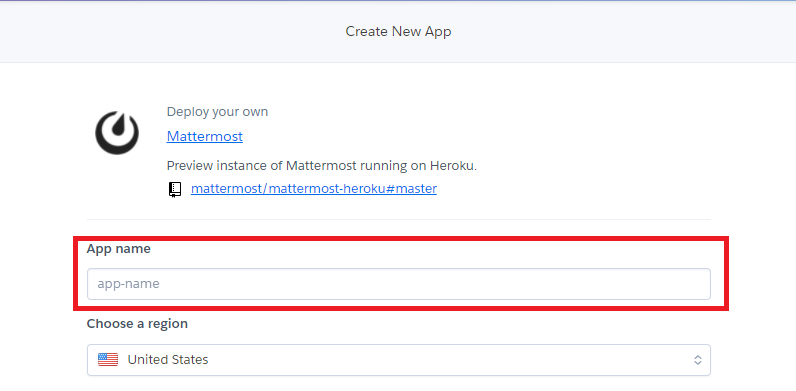
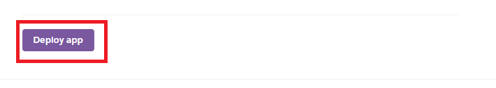
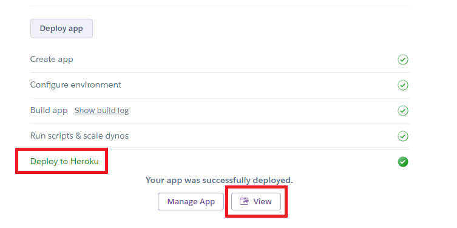
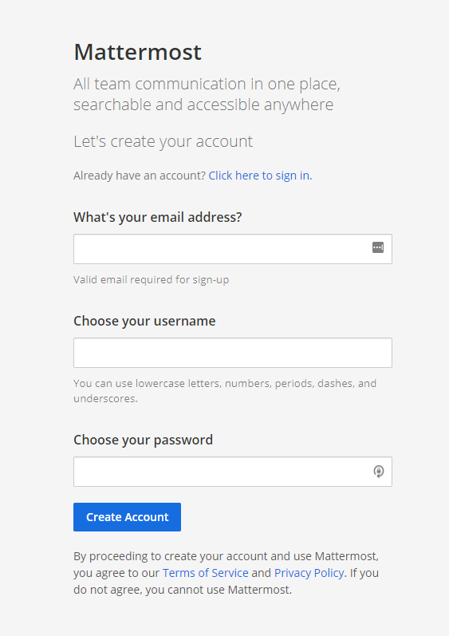

# Mattermost導入方法

1. herokuアカウントを作成
    - [Heroku](https://signup.heroku.com/login?redirect-url=https%3A%2F%2Fid.heroku.com%2Foauth%2Fauthorize%3Fclient_id%3Dd2ef2b24-e72c-4adf-8506-28db2218547d%26response_type%3Dcode%26scope%3Dglobal%252Cplatform%26state%3DSFMyNTY.g2gDbQAAAHhodHRwczovL2Rhc2hib2FyZC5oZXJva3UuY29tL2F1dGgvaGVyb2t1L2NhbGxiYWNrP3N0YXRlPTU0YWQyNDMwOTkxYzM0ZGNjOTI4NTY1OWU0NmRmMmUxNjZkNzIwNzc5ZDdhOWJhYmQ1MWIyNTMyNTdmYjJhNzZuBgAYFVO-fgFiAAFRgA.120W6AasxtnBONrJEyVG64zrQf3gtXWKmG5TEnWAEt8)
2. 以下URLにアクセス
    - URL：https://heroku.com/deploy?template=https://github.com/mattermost/mattermost-heroku
3. 「App name」に任意の名前を入力し、「Deploy app」ボタンを押下する。

4. 「Deploy to Heroku」と表示されれば成功。

5. 「View」ボタンからサイトに遷移し、設定を行う。

