# 環境構築手順書の作成方法

---

## 必要なもの
- Visual Studio Code
    - 拡張機能：`Markdown All in One`, `Markdown Preview Enhanced`
- ペイント（Windows標準搭載）

---

## Visual Studio Codeインストール方法

1. 以下のURLにアクセスする。
    - [インストーラー](https://code.visualstudio.com/download)
2. `windows` を押下する。

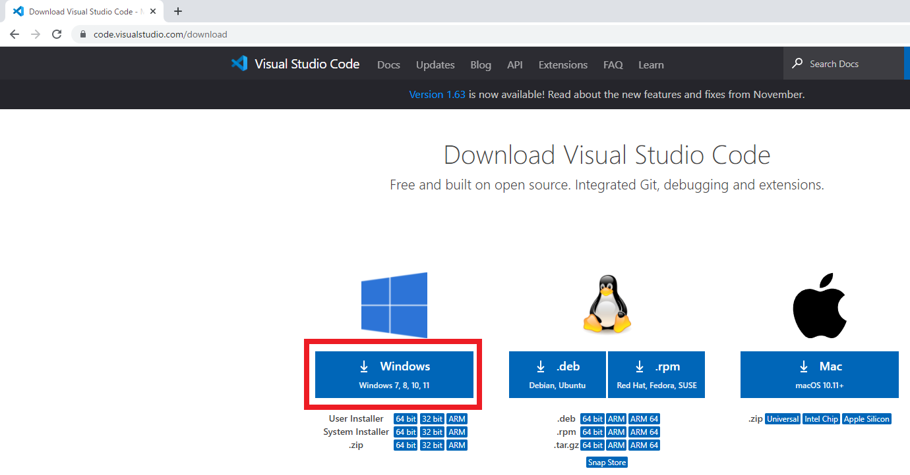

3. ダウンロードが完了後、フォルダを開く。

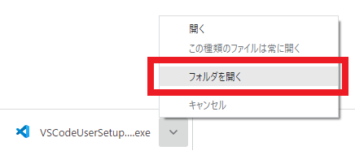

4. `VSCodeUserSetup-x64-1.63.2.exe` を起動する。（ダブルクリック）

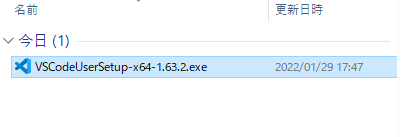

5. `同意する(A)` を選択し `次へ` を押下する。

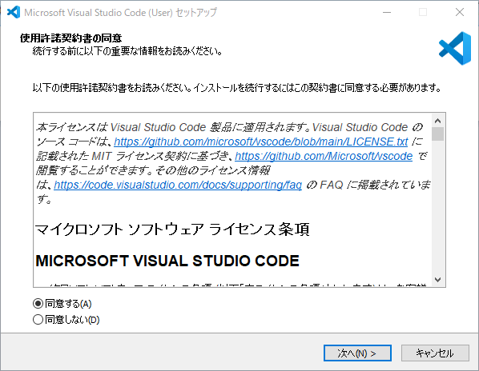

6. 以下の画像の項目をチェックし、 `次へ` を押下する。

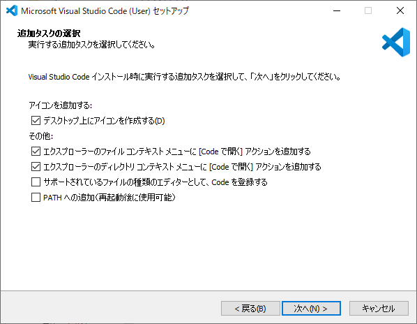

7. `インストール(I)` を押下する。

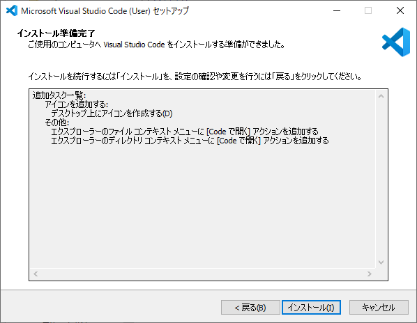

8. `完了` を押下する。

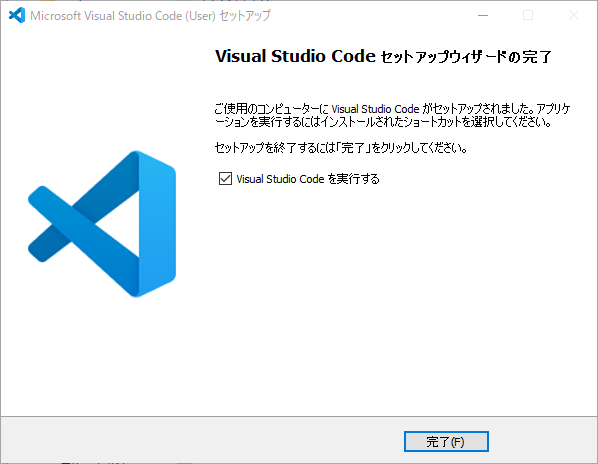

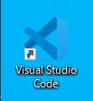

9. `Visual Studio Code` が起動すれば成功。

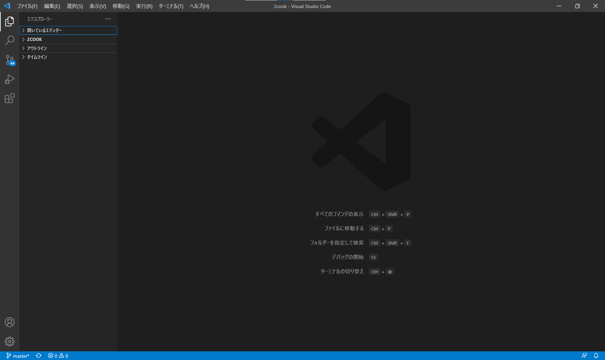

---

## Visual Studio Code拡張機能の入れ方

1. `Visual Studio Code` の拡張機能は左側のメニューのブロックアイコンをクリックして開く。
2. 検索ボックスにインストールしたい拡張機能名を入力すると候補が表示される。

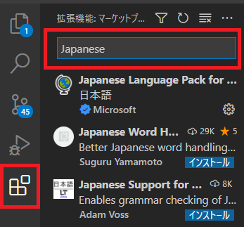

3. インストールしたい拡張機能を表示し、インストールボタンをクリックする。

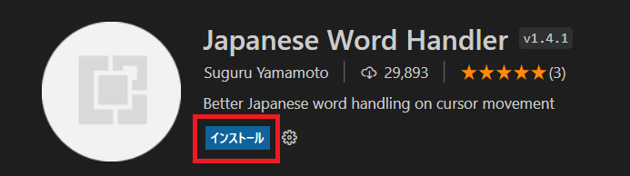

4. インストールが完了すると、画面には `無効にする` と `アンインストール` が表示される。

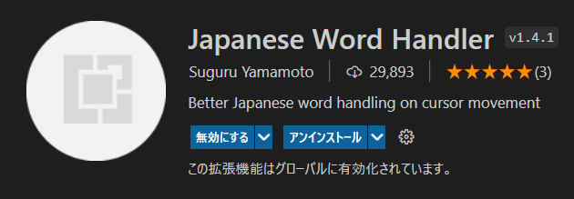

5. 検索ボックスを空にすると `インストール済みの拡張機能` が一覧表示される。

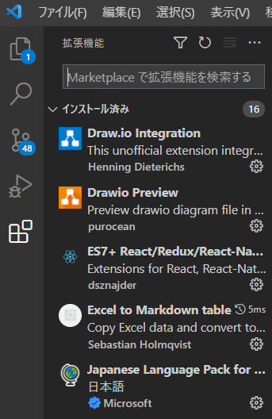

---

## ペイント（Windows標準搭載）の開き方

1. `windowsキー` + `shift` + `S` を同時に押下し、画面のキャプチャを取る。
2. `windowsキー` を押下し、`ペイント` と検索する。
3. `ペイント` を起動させる。

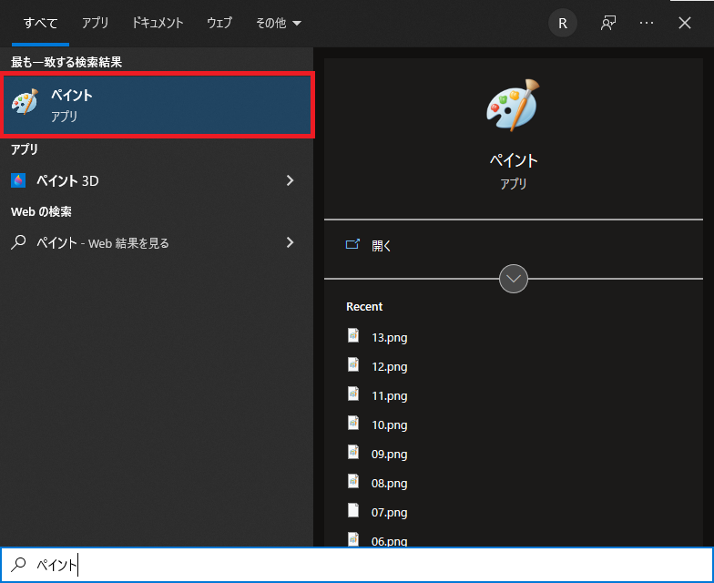

4. `ctrl` + `V` でペイントに画像を張り付ける。
5. `ファイル > 名前を付けて保存` から画像を保存する。

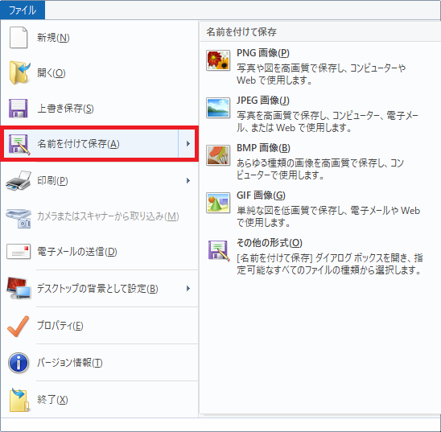

6. 画像のトリミング（切り取り）を行いたい場合は、 `選択ボタン上の点線` を押下し、範囲を選択し、`トリミング`を押下する。

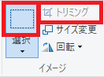

7. 赤枠を挿入して強調したい場合は、図形から `四角を選択` し、塗りつぶしから `塗りつぶしなし` にし、`線の幅を最大` にし、`色1を赤色` にして範囲を選択する。

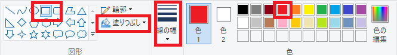

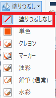

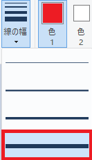

---

## MDファイルの作成方法
1. フォルダを開き、右クリックから `Codeで開く` を選択する。

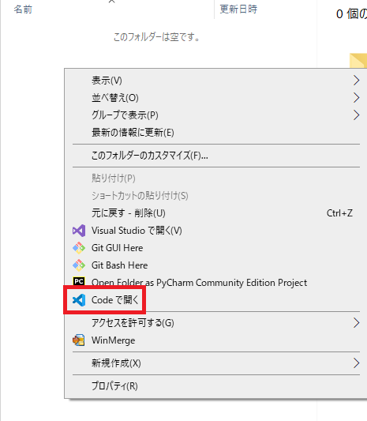

2. `Visual Studio Code` が開いたら、エクスプローラー配下で右クリックから `新しいファイル` を選択する。

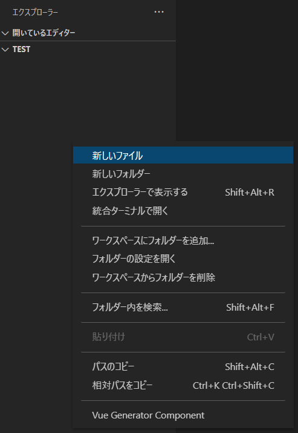

3. 拡張子に `.md` を付けたファイルを生成する。

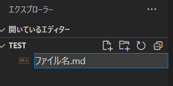

4. Markdownの記述方法は以下参照
    - [Markdown記法/書き方（見出し・表・リンク・画像・文字色など）](https://notepm.jp/help/how-to-markdown)
    - [Qiita マークダウン記法 一覧表・チートシート](https://qiita.com/kamorits/items/6f342da395ad57468ae3)

5. 本システム開発に必要な環境は以下参照
    - [環境構築](./01環境構築/環境構築一覧.md)